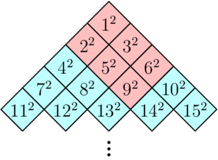
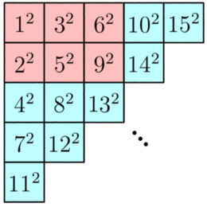

千里之行，始于足下。

<!--more-->

!!! abstract 
    - [x] 1826. Codeforces Round 870 (Div. 2)
        - E. Walk the Runway
        - F. Fading into Fog
    - [ ] 1828. Codeforces Round 873 (Div. 2)
        - D2. Range Sorting (Hard Version)
        - E. Palindrome Partition
        - F. Two Centroids
    - [x] 1829. Codeforces Round 871 (Div. 4)
        - G. Hits Different
    - [x] 1837. Educational Codeforces Round 149 (Rated for Div. 2)
        - E. Playoff Fixing
        - F. Editorial for Two
    - [x] 1840. Codeforces Round 878 (Div. 3)
        - F. Railguns
        - G2. In Search of Truth (Hard Version) 
    - [ ] 1848. Codeforces Round 885 (Div. 2)
        - C. Vika and Price Tags
        - D. Vika and Bonuses
        - F. Vika and Wiki
    - [x] 1850. Codeforces Round 886 (Div. 4)
        - F. We Were Both Children
        - H. The Third Letter   

## 1826. [Codeforces Round 870 (Div. 2)](https://codeforces.com/contest/1826)

### [E. Walk the Runway](https://codeforces.com/contest/1826/problem/E)

**Description**

$n$ 个人每个人都有一个价值 $p_i$，然后这 $n$ 个人有 $m$ 维数值，要求你从中选取若干个人并且可以任意调整选的人的顺序，要求选的人满足 $m$ 维中每一维里选的人的数值都严格递增。

$n \le 5000,m \le 500$。

**Solution**

如果我们已知两个人之间的偏序关系，我们可以在两个人之间连一条有向边（或不连），故这 $n$ 个人的关系可以用一个有向无环图来表示，在图上跑 dfs，时间复杂度是 $O(n^2)$，是完全够的，那么我们现在研究如何求任意两个人之间偏序关系。

直接暴力求偏序关系的时间复杂度是 $O(n^2m)$，显然是会 T 的，那么我们可以用 bitset 来优化。对每一维排完序后前面的肯定不会排在这个数的后面，故每次用 bitset 的 & 运算即可，时间复杂度是 $O(\dfrac{m}{w})$，其中 $w$ 等于 $64$。

[Code](https://codeforces.com/contest/1826/submission/212761847)

### [F. Fading into Fog](https://codeforces.com/contest/1826/problem/F)

**Description**

交互题

有 $n$ 个隐藏点，每次你可以给出 $a$，$b$，$c$，询问一条形如 $ax+by+c=0$ 的直线，交互库会以**任意顺序**告诉你每个点在直线上的投影（保证每个返回的投影点与真实投影点的距离不超过 $10^{-4}$）。

请用最少的询问求出这些隐藏点的位置，精度相差 $10^{-3}$ 即可。

保证每个隐藏点的与其他隐藏点的 $x$ 坐标和 $y$ 坐标都至少相差 $1$，每次询问的 $∣a∣+∣b∣≥0.1$。

**Solution**

通过画图观察不难发现，其实最多三次询问就可以确定这 $n$ 个点了，所以题目就变为不超过三次询问求出 $n$ 点，一条平行 $x$ 轴，一条平行 $y$ 轴，一条斜着的边（但是很贴近 $x$ 轴），前两个就可以确定这 $n$ 个点的横纵坐标，第三个完全确定这 $n$ 个点。

为什么第三条线要贴近 $x$ 轴呢？因为我们的处理方法是对第一，三条线得到的 $n$ 个投影点按横坐标排序，选一条贴近 $x$ 轴的线保证这 $n$ 个点和第一条线的 $n$ 个点顺序一致，这样的话我们就可以算出每个点纵坐标的值，但不准确可能会有误差，但是我们知道每个点的纵坐标，所以我们可以找纵坐标和我们计算的估计值中最贴近的值来替换。

值得注意的是，本题对精度要求较高，应用 `long double` 来存储

[Code](https://codeforces.com/contest/1826/submission/212805712)

## 1828. [Codeforces Round 873 (Div. 2)](https://codeforces.com/contest/1828)

### [D2. Range Sorting (Hard Version)](https://codeforces.com/contest/1828/problem/D2)

**Description**

对一个数组 $\{p_i\}$ 的一段区间 $[l,r]$ 排序的代价为 $r−l$ ，对整个数组 $p_i$ 排序的代价为选定若干区间并排序，使得整个数组有序的代价之和。

求 $\{a_i\}$ 的所有子段排序的代价之和。

Easy Version $n \le 5 \times 10^3$

Hard Version $n \le 3 \times 10^5$

**Solution**

有点难想。

仔细观察样例，不难发现一些性质：

- 操作区间一定是不重叠的，不然直接对整个区间操作更优。
- 尽可能多区间操作会使答案更优。
- 更分成两个区间操作则一定满足前一个区间的最大值小于后一个区间的最小值。

那么基于以上性质，我们很容易搞出 $O(n^3)$ 暴力：枚举区间左右端点，枚举中间间隔点，提前用 st表 预处理出区间最大最小值然后来求，但是这样发现连 Easy Version 都过不了，故我们可以来稍改进一下思路。

对于 Easy Version，我们可以固定左端点，每次枚举右端点，每次向后加入一个新的数时，我们要重新计算对答案的贡献，我们算 $[l, r]$ 区间的答案就是区间长度减去最多可拆分区间数，假设我们已经知道了 $[l, r - 1]$ 区间的答案以及划分区间，加入 $a_r$ 数后，我们其实就是要把这个数和某个区间合并，满足合并后的区间的最小值依然大于前面区间的最大值。所以我们可以记录之前几个划分区间的最大值，然后不断向前跳，看 $a_r$ 可以和哪几个区间合并，找到第一个可以合并的区间就直接合并，这样一定是最优的。合并完之后更新新的拆分区间，答案也比较好统计，时间复杂度 $O(n^2)$。

对于 Hard Vesion，我们发现很难从 Easy Version 上再继续优化，我们换另一个思路。能过 $3 \times 10^5$ 的做法应该是 $O(nlogn)$ 或 $O(n)$ 的，所以我们要找到这个复杂度的算法应该是算每个位置所能做出的贡献。我们先算最坏情况下一共的代价为 $\sum_{i = 2}^{n}(i - 1)(n - i + 1)$，然后我们再算每个位置对代价能减少的贡献。若能对答案产生减少的贡献，对于一个大区间，我们一定可以拆分成两个小区间。对于每个位置，我们不妨假设这个位置 $i$ 上的数是后一个区间的最小值。然后我们往后找到第一个小于 $a_i$ 的数的位置 $r_i$（这里求“第一个小于“这样的位置，我们可以用单调栈来求），然后再往前找第一个小于 $a_i$ 的数的位置 $l_i$，那么我们可以确定后一个区间的左端点是 $(l_i + 1)$，右端点是在 $i \sim (r_i - 1)$ 里选。然后前一个区间的右端点是 $l_i$，最后只用确定前一个区间的左端点，这里我们可以用 st表 先求出区间最大值，然后不断跳表来求出左端点 $kdl$。然后这个位置的数对答案减少的贡献为 $(r_i - i)\times(l_i - kdl + 1)$，时间复杂度为 $O(nlogn)$。

[Code (Easy Version)](https://codeforces.com/contest/1828/submission/212909151)

[Code (Hard Version)](https://codeforces.com/contest/1828/submission/213004607)

### [E. Palindrome Partition](https://codeforces.com/contest/1828/problem/E)

**Description**

称一个字符串是好的，当且仅当它是一个长度为偶数的回文串或由若干长度为偶数的回文串拼接而成。

给定一个长度为 $n$ 的字符串 $s$，求有多少 $s$ 的子串是好的。

$1≤n≤5×10^5$，$s$ 仅包含小写字母。

**Solution**

根据数据范围可以得出正解的时间复杂度应该是 $O(n)$ 或 $O(nlogn)$ 的。

本题采用动态规划，可以令 $g[i]$ 表示以 $i$ 结尾的好串个数，那么显然答案就是 $\sum_{i = 1}^n g[i]$ 。那么怎么求 $g[i]$ 呢，我们考虑到对于一个回文串，我们把它尽可能多分为由若干回文字串组成，分到不能分为止。这样分解出来的每一个回文串里一定不会包含回文前缀 / 后缀（因为要是包含的话就又可以分解了）。这样分解之后，对于一个好的字符串，一定是由若干小的不可分解的回文串组成。而且显然这种分解方法是唯一的。说明这样的话，对于每个好的字符串而言我们只算了一次，正是我们想要的。基于这个思路，我们再引入一个新的数组 $f[i]$，$f[i]$ 表示以 $i$ 结尾的回文串的最小长度，因为以 $i$ 结尾的字串一定是包含以 $i$ 结尾的最小回文串的，而且基于之前的分解方法，我们可以得到 $g[i] = g[i - f[i]] + 1(f[i] \ne 0)$，当 $f[i] = 0$ 时，$g[i] = 0$。那么现在我们将问题转化为了如何求 $f[i]$，我们先进行一遍 Manacher 算法，求出以每一位为对称轴的最大回文半径，由于要求是偶回文，所以我们只考虑以两个位置中间为轴。我们发现，若以第 $i$ 位为轴，那么 $[i + 1, i + len[i]]$ 这个范围内是都可以作为回文结尾的，可以被 $i$ 覆盖。而想要让回文最小，就是从后向前扫一遍，如果先被以 $i$ 覆盖的，一定满足以 $i$ 为轴回文最小，我们知道了右端点和回文轴就可以计算出回文长度了，也就可以计算出 $f[i]$ 了，要注意的是，如果区间中一部分点被之前的对称轴覆盖了，那么我们被之后对称轴覆盖时要跳过这几个点，可以用双向链表来维护。

[Code](https://codeforces.com/contest/1828/submission/213452328)

### [F. Two Centroids](https://codeforces.com/contest/1828/problem/F)

**Description**

**Solution**

## 1829. [Codeforces Round 871 (Div. 4)](https://codeforces.com/contest/1829)

### [G. Hits Different](https://codeforces.com/contest/1829/problem/G)

**Description**

若干块以金字塔状摆放，用球击倒下方的，上方也会倒下，第 $n$ 块分数 $n^2$，问用球打第 $n$ 块能得多少分

**Solution**

方法一：

​	动态规划， $f[i]$ 表示击打第 $i$ 块能得的分数，$f[i] = f[左上] + f[右上] - f[公共]$，因为左上和右上是有公共部分会多算，所以简单容斥一下

方法二：

​	还是动态规划，先把图倾斜 $45°$

​	

​	感觉变好看了一点（？）

​	再转45°

​	嗯，变成一个简单二维DP就能解决的问题了

[Code (Method I)](https://codeforces.com/contest/1829/submission/211201013)

[Code (Method II)](https://codeforces.com/contest/1829/submission/211200275)

## 1837. [Educational Codeforces Round 149 (Rated for Div. 2)](https://codeforces.com/contest/1837)

### [E. Playoff Fixing](https://codeforces.com/contest/1837/problem/E)

**Description**

给定数 $k$，一共有 $2^k$ 个人参加比赛，序号越小的实力越强。每轮第 $2i$ 和 $2i-1$ 进行比赛，一共进行 $k$ 轮，最后要求序号为 $1$ 的一直留到最后一轮，序号为 $2$ 的留到倒数第二轮，序号为 $3 \sim 4$ 的留到倒数第三轮，以此类推，序号 $2^{k - 1} + 1$ 到 $2^k$ 的人要求第一轮淘汰，给定部分人当前位置，如果这个位置上还没确定选手就用 $-1$ 表示，问一共又有多少种表示合法方案

**Solution**

第一轮中，我们可以知道序号 $2^{k - 1} + 1$ 到 $2^k$ 的人可以安排在哪里，一定是在 $\{1,2\}$，$\{3,4\},\cdots, \{2^k - 1,2^k\}$ 中各选一个，如果两个都没选则两个位置都可以放，记一下这种情况的个数是 $cnt1$，如果一个位置放了小于 $2^{k-1}$ 的序号，那么只能选另一个位置放，如果两个位置都被选了且不合法，那么就返回 $0$，设一共有 $cnt2$ 个可以放的位置，那么这轮方案数是 $2^{cnt1} \times cnt1 !$ 而且这一轮放置的人下一轮都被淘汰了，所以无后效性，然后下一轮其实就变为规模折半的子问题，不断迭代计算即可

[Code](https://codeforces.com/contest/1837/submission/211143124)

### [F. Editorial for Two](https://codeforces.com/contest/1837/problem/F)

**Description**

$n$ 个数中选 $k$ 个数（不改变在原序列中顺序），要求这 $k$ 个数分为前后两半后，这前后两部分和的最大值尽可能小。

**Solution**

这道题可以用二分来做，对于二分值 $lim$，先正着扫一遍，再倒着扫一遍，扫到第 $i$ 位置时，我们只要算一下前 $i - 1$ 位置中 和不超过 $lim$ 的最多可以选的数的个数 + 后 $i$ 到 $n$ 位置中 和不超过 $k$ 的最多可以选的数的个数  之和是不是大于 $k$ 即可。

[Code](https://codeforces.com/contest/1837/submission/211151946)

## 1840. [Codeforces Round 878 (Div. 3)](https://codeforces.com/contest/1840)

### [F. Railguns](https://codeforces.com/contest/1840/problem/F)

**Description**

Tema 在 $n⋅m$ 的网格内要从 $(0,0)$ 走到 $n⋅m$。第 $0$ 秒末 Tema 位于 $(0,0)$。

每次行动 Tema 可以选择向下走，向右走或不动。

机器人会发射 $r$ 次激光炮以阻挠他前进，具体为在第 $t$ 秒，向第 $x$ 行或第 $x$ 列发射激光炮，一整列或一整行都会受到炮击。若 Tema 在第 $t$ 秒末还停留在被炮击的单元格内则会被击毁。求 Tema 从 $(0,0)$ 到达 $(n,m)$ 的最短时间，若无法抵达，则输出 $−1$。

$r$ 次炮击格式为 $t$，$d$，$coord$ ，$t$ 表示炮击发生的时间，$d$ 表示炮击方式 ( $d=1$ 时攻击一整行，$d=2$ 时攻击一整列)，$coord$ 表示攻击的是具体哪一行/列）

**Solution**

设 $f[i][j][k]$ 表示在 $k$ 时刻到第 $i$ 行第 $j$ 列是否合法，由于我们发现时间 $t$ 的范围是到 $10^9$ 且到达某位置的时间 $t$ 只和 $i$，$j$，和停下躲避了几次有关，而且躲避的次数最多不超过 $100$ 次，所以 $k$ 可以用停下躲避的次数来表示，这样转移方程就很简单了  $f[i][j][k] = f[i - 1][j][k] | f[i][j - 1][k] | f[i][j][k - 1]$ 。

[Code](https://codeforces.com/contest/1840/submission/211968399)

### [G2. In Search of Truth (Hard Version)](https://codeforces.com/contest/1840/problem/G2)

**Description**

交互题

一个转盘共 $n$（ $n$ 未知 ）个格子，格子 $1$ 到 $n$ 乱序编号，你每次可以顺/逆时针旋转 $k$ 个格子，输出顺/逆时针（分别用“+”、“-”表示）和 $k$。需要读取起始格子的编号和每次旋转后格子的编号，求 $n$。

Easy Version 中旋转次数不大于 $2023$ 。

Hard Version 中旋转次数不大于 $1000$ 。

$n≤1×10^6,−10^9≤k≤10^9$ 。

**Solution**

很不错的一道题

对于 Easy Version，参考 BSGS 算法，先连续 999 次 +1，然后每次 +1000，这样最多 1000 次就可以循环完一圈，然后走完一圈后必定会落在最初连续的前 1000 个格子上，我们可以通过转了多少正好可以走一圈来推算 n 的大小，最多询问 999 + 1000 次。

对于 Hard Version，我们在 Easy Version 基础上稍加改进，我们对于一个 $n$，可以先转 $n_0$，然后再按 G1 的方法去转，先连续转 $d$ 个 $+1$，再一直 $+d$ 直到转完一圈为止，但是这个 $n_0$ 和 $d$ 如何确定呢。我们可以先随机 $k$ 次，然后去这 $k$ 次中得到的最大的数选为 $n_0$，因为如果直接选的话，选的数可能过大或过小，若是不随机选 $k$ 个数而是连续选 $k$ 个或间隔选 $k$ 个则容易被卡掉。不过这个算法由于是一定程度上取决于随机数的，所以不一定完全正确，当 $n$ 大于 $n_0 + d^2$ 时，就无法转到一圈，此时不对。所以 $k$ 次算出的数必须有一个要大于 $n - d^2$，出错的概率为 $P(A) = (\frac{n - d^2 - 1}{n})^k,(k + 2d = 1000)$，不难发现通过改变 $n$ 和 $k$ 大小是可以改变出错概率的，当选择 $k = 400, d = 300$ 时，即使是在 $n = 10^6$ 情况下 $P(A)$ 的数量级才是 $10^{-17}$，远远小于 $1$，故可以通过此题。

[Code (Easy Version)](https://codeforces.com/contest/1840/submission/212058294)

[Code (Hard Version)](https://codeforces.com/contest/1840/submission/212063730)

## 1848. [Codeforces Round 885 (Div. 2)](https://codeforces.com/contest/1848)

### [C. Vika and Price Tags](https://codeforces.com/contest/1848/problem/C)

**Description**

有 $a$, $b$ 两个长度均为 $n$ 序列， 一次变换记为 $a_i \to b_i, b_i \to \left | a_i - b_i \right | $，问是否可以经过若干次变换使得 $a$ 中所有元素全部变成 $0$。

**Solution**

不难发现，若 $(a_i, b_i)$ 中有一个元素变为 $0$（不是 $(0, 0)$ 情况），则 $(a_i, b_i)$ 则会经历 $(0, x) \to (x, 0) \to, (x, x) \to(0, x)$ 以 $3$ 为周期的变换。

所以我们要求的是每个元素变为 $(x, 0)$ 的次数模 $3$ 的余数。

不妨设 $a >> b$，则变换经历 $(a, b) \to (b, a - b) \to (a - b, a - 2b) \to (a - 2b, b)$ 。不难发现每三次会经历一次周期，每次 $a \to a - 2b$。这样的话我们就可以用辗转相除法来求了。

[Code](https://codeforces.com/contest/1848/submission/220325561)

### [D. Vika and Bonuses](https://codeforces.com/contest/1848/problem/D)

**Description**

初始有一个数 $s$，每次可以进行两种操作，获得价值为 $s$ 的利润或让 $s \to s + (s \mod 10)$，你可以进行 $k$ 次，问 $k$ 次之后的最大价值。

**Solution**

不难发现，个位是 $5$ / $0$ 的话，最多只能操作一次。

个位是 $1$ / $3$ / $7$ / $9$ 的话，操作一次后变为 $2$ / $6$ / $4$ / $8$。

而个位如果是 $2$ / $4$ / $6$ / $8$ 的话，则会有 $2 \to 4 \to 8 \to 6$ 的循环，我们记 $4$ 次操作为一个周期，一个周期可以让 $s \to s + 20$。

则题目变为求周期数 $x$，使 $(s + 20 \times x) \times (k - 4 \times x)$ 最大，但是注意，这个周期的开头我们还要枚举，因为末尾可能是 $2$ / $4$ / $6$ / $8$ 中任一数。

[Code](https://codeforces.com/contest/1848/submission/220463956) 

### [F. Vika and Wiki](https://codeforces.com/contest/1848/problem/F)

**Description**

给定一个长度为 $n$ 的数组 $a$（其中 $n$ 为 $2$ 的幂次），记一次变换为将整个数组 $a_i \to a_i \oplus a_{(i + 1) \mod n}$。 

**Solution**

手动模拟若干次后，我们发现当进行 $2^n - 1$ 次后，数组每个元素 $a_i \to \oplus_{j = 0}^{2^n}a_{i + j(\mod n)}$，利用这个性质我们可以先进行 $2 ^n - 1$ 次然后再进行 $1$ 次。这样就进行了 $2^k$ 次，时间复杂度为 $O(nlogn)$。

[Code](https://codeforces.com/contest/1848/submission/220480211)

## 1850. [Codeforces Round 886 (Div. 4)](https://codeforces.com/contest/1850)

### [F. We Were Both Children](https://codeforces.com/contest/1850/problem/F)

**Description**

$n$ 只青蛙，每次只挑 $a_i$ 的倍数的格子，要你再前 $n$ 格内放置一个陷阱，使尽可能多的青蛙跳进去。

$n \le 10^5$ 。

**Solution**

如果知道第 $i$ 个格子能跳 $f_i$ 只青蛙，则可以将所有 $i$ 倍数格子全部加上 $f_i$ 。

故两层循环枚举即可。时间复杂度 $O(\sum_{i = 1}^n \dfrac{n}{i}) \approx O(nlnn)$ 。

[Code](https://codeforces.com/contest/1850/submission/218473979)

### [H. The Third Letter](https://codeforces.com/contest/1850/problem/H)

**Description**

若干点分布在一系列 $x$ 轴上，告诉你若干点之间的约束条件（在 左 / 右 xx 的位置处）。然后问你这一系列条件是否合理。

**Solution**

本题的模型可以抽象成一个有向图。但是这 $n$ 个点可能是若干连通块，不一定全是连通的。

每次从一个点出发，设这个点的位置是 $0$，然后标记出所有和这个点相关的点的坐标。

最后再把这些约束关系一一查询，看最后是否满足条件。

[Code](https://codeforces.com/contest/1850/submission/219780470)
