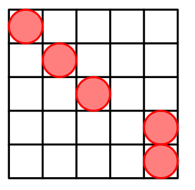

# 1961 ~ 1970
## [1965. Codeforces Round 941 (Div. 1)](https://codeforces.com/contest/1965)

### [C. Folding Strip](https://codeforces.com/contest/1965/problem/C)

**Solution:**

Good problem.

**Statement: If two adjacent numbers are equal, then we are supposed to fold it.**

[Proof](https://codeforces.com/blog/entry/128914)

The final answer must be `010101010101...` or `1010101010...`

Put the beginning of the string at the position $0$, then simulate the folding procession and write down the maximum and minimum position.

The answer is `maximum - minimum + 1`.

## [1967. Codeforces Round 942 (Div. 1)](https://codeforces.com/contest/1967)

### [C. Fenwick Tree](https://codeforces.com/contest/1967/problem/C)

**Solution:**

Once f function can convert $\{a_i\}$ into $\{c_i\}$.($c_i$ is the fenwick tree array of $a_i$)

For a position u, we should figure out which positions it contributes to.

In the fenwick tree, if v is d-th ancestor of u, then $b_u$ can contribute to $b_v$. 

The number of contribution which u dose to v is $\binom{d + k - 1}{k - 1} \times b_u$, cause every option we can go forward any steps (even $0$).
So $b_v$ should minus $\binom{d + k - 1}{k - 1} \times b_u$.

For every position, $b_i$ minus all the number other positions contribute to before should be the answer.

## [1968. Codeforces Round 943 (Div. 3)](https://codeforces.com/contest/1968)

### [E. Cells Arrangement](https://codeforces.com/contest/1968/problem/E)

**Solution:**

For $n \le 3$, we can easily find the answer.

And for $n = 4$, the answer is:

    
for $n = 4$, the answer is:

So we can generate the following patterns by putting cells at the top left position. 
  
### [F. Equal XOR Segments](https://codeforces.com/contest/1968/problem/F)

**Solution:**

If $a_l \oplus a_{l + 1} \oplus ... \oplus a_r = 0$, then there must be answers.

If $a_l \oplus a_{l + 1} \oplus ... \oplus a_r = k$, find a position $i$ satisfying that $s_i = s_r$ and a position $j$ satisfying that $s_j = s_{l - 1}$, and if $i < j$ then there must be answers.
($s_i = a_1 \oplus ... \oplus a_i$)

## [1969. Educational Codeforces Round 165 (Rated for Div. 2)](https://codeforces.com/contest/1969)

### [E. Unique Array](https://codeforces.com/contest/1969/problem/E)

**Solution:**

Greedy + Segment Tree

We use the greedy tragedy, deal with each position from front to the end, 
if when we deal with i-th position, the prefix array can't safisfy the condition, 
then we should translate the i-th number into one which has never occurred before.

How to judge it is illegal? We can use segment tree to maintain the array. 
we can know that the right point of the illegal part is i, then we should find the left point.

$C_j$ denotes the different kinds of number in the segment whose left point is j and right point is i.
If $C_j$ is zero, then the segment is illegal. So we should find the minimum of the $C_j$. 
To update, it's an segment modify operation. So we can use segment tree to deal with these two operations.
