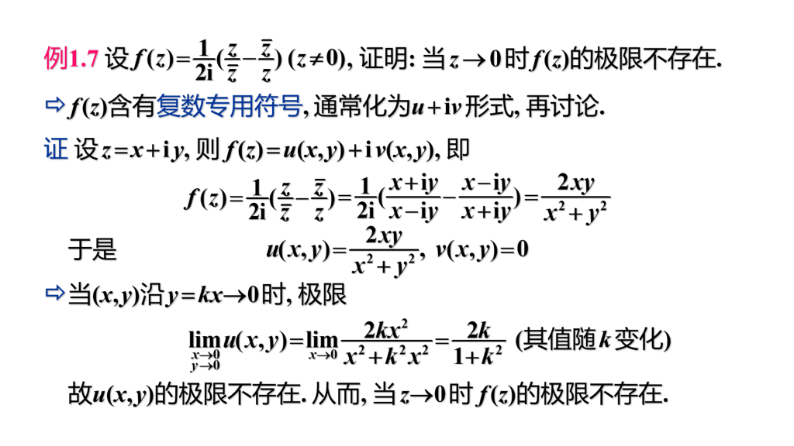
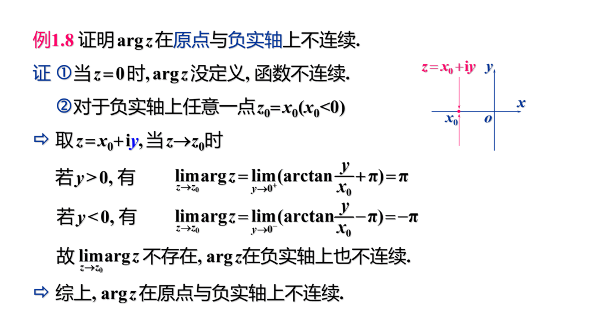

# 第一章 复数与复变函数

!!! note
    $u = \mathrm{Re}[z]$ 称为实部，$z = \mathrm{Im}[z]$ 称为虚部。

## 0 总结

## 1 复数及其几何表示

- 复数可以用点 / 向量 / 矩阵表示。
- $Argz$ 是复数的辐角，$argz$ 是辐角在 $(-\pi, \pi]$ 中的值，又称为辐角的主值（$\left | z\right | = 0$ 时辐角无意义）。$Argz = argz + 2k\pi$。
- 复数 $z = x + iy = r(\cos\theta + i\sin\theta) = re^{i\theta}$。
- 复数 $n$ 次幂 $z^n = r^ne^{in\theta} = r^n(\cos n\theta + i\sin n\theta)$
- **复数 $n$ 次方根 $w = \sqrt[n]{z} = \sqrt[n]r(\cos \dfrac{\theta + 2k\pi}{n} + i\sin \dfrac{\theta + 2k\pi}{n})$，$k$ 从 $0$ 取到 $n - 1$ 时，对应会有 $n$ 个不同的方根。**

- 表示复数的平面称为复平面，表示复数的球面称为复球面。
- 某复数对应的球面上的点，复平面上的点和复球面的 $N$ 极三点共线。（除 $N$ 极外，球面和平面上的点一一对应）
- 我们在复平面上引入一个 $\infty$ 点与球面 $N$ 极相对应，并将复平面加上无穷远点称为**扩充复平面**，与扩充复平面一一对应的平面称为**复球面**，没有 $\infty$ 的复平面称为 **（有限）复平面**。
- 对于复数 $\infty$，其实部，虚部，幅角均没有意义，其模长为 $\infty$，并且四则运算与实数 $\infty$ 相同。

## 2 复变函数

- 复变函数就是变量为复变量的函数（可能一对一，可能一对多）。

- 区域的概念同二元函数中的概念。

  > 开集就是一块点集不算上边界。
  >
  > 连通的开集称为区域。
  >
  > 算上边界的开集是闭区域。
  >
  > 自身无交叉点的曲线称为简单曲线。
  >
  > 单连通域内部实心，多连通域内部不是实心。

- 对于**连续曲线** $C$ 有 $x = x(t), y = y(t)$，则称$z(t) = x(t) + iy(t)$ 为平面曲线的复数表示式。若 $x'(t), y'(t)$ 均连续且不同时为 $0$，则称 $z(t)$ 为光滑曲线。由几段光滑曲线联接而成的曲线称为**按段光滑曲线**。

- 自身无重点的曲线称为**简单曲线**。起点和重点重合的简单曲线称为**简单闭曲线**。

- 若区域 $D$ 内任意简单简单闭曲线的内部都属于 $D$，则称 $D$ 为单连通域，否则称为多连通域。

- 复变函数可化为两个实变函数相加，求复变函数的极限 / 连续 / 有界问题也可以化为两个实变函数的极限 / 连续 / 有界问题。

## 3 例题

求下列极限

$\lim_{z \to 0} \dfrac{\mathrm{Re}(z)}{z}$

令 $y = kx$ 后发现极限不存在。

$\lim_{x + iy \to 1 + i}\left[\dfrac{y\ln(2 - x)}{x - 1} + ixy \right]$

$\dfrac{y\ln(2 - x)}{x - 1}$ 比较难处理，要把 $x$ 和 $y$ 分开看待，对 $x$ 部分用一个洛必达，$y$ 直接看作 $1$。

