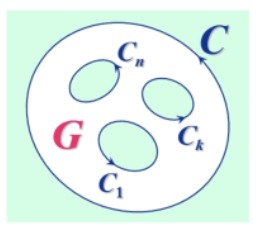
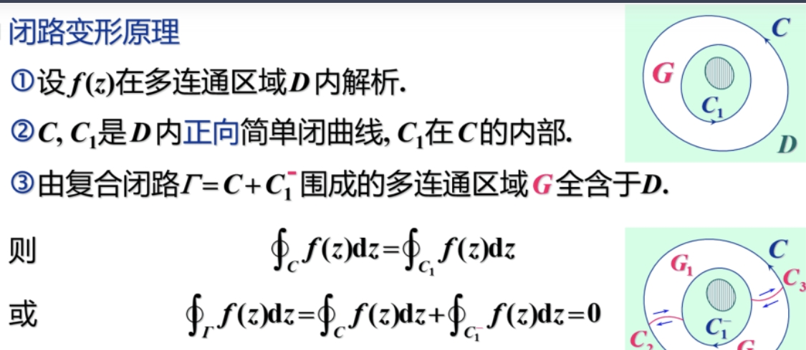

# 第三章 复变函数的积分

## 0 总结

- 若 $f(z)$ 不解析，$\int f(z)$ 按路径来设变量，分别积分再加起来。

  > **此时不能直接积分！一定要按路径来！**
  >
  > **只有解析函数积分与路径无关，可以直接求解。**

- 积分与路径无关的条件是 $f(z)$ 在单连通域内解析。

- 柯西积分定理 $f(z)$ 在 $C$ 内处处连续，处处解析，那么 $\oint_C f(z)dz = 0$。

- 复合闭路定理 外面大圈积分等于里面小圈积分和 $\int_C f(z)dz = \sum_{k = 1}^n \oint_{C_k}f(z)dz$。

- 柯西积分公式 $\oint_C \dfrac{f(z)}{z - z_0}dz = 2 \pi i f(z_0)$，$z_0$ 为任一点，要保证闭曲线内只有一个奇点。

- 高阶导数公式 $f^{(n)}(z_0) = \dfrac{n!}{2\pi i}\oint_C \dfrac{f(z)}{(z - z_0)^{n + 1}}dz$，$z_0$ 为任一点，要保证闭曲线内只有一个奇点。也即 $\oint_C \dfrac{f(z)}{(z - z_0)^{n + 1}} = \dfrac{2\pi i}{n!} f^{(n)}(z_0)$。

- 对于多个奇点，以这些奇点为圆心做圆周，然后由复合闭路定理：$\int_C f(z)dz = \sum_{k = 1}^n \oint_{C_k}f(z)dz$，就可以化为 $n$ 个单奇点的积分。注意若没有奇点，说明单连通域内处处可解析，此时用柯西 - 古萨特定理直接得出积分为 $0$。

- 调和函数：满足二阶偏导数连续且满足拉普拉斯方程。

- 共轭调和函数：指一对调和函数 $u(x, y),v(x, y)$ 满足 $f(z) = u(x, y) + iv(x, y)$ 是解析函数。 这样的 $u(x, y),v(x, y)$ 是一对共轭调和函数。

- 求解析函数（已知实部或虚部）：全微分法，偏微分法，原函数法（首选）。

## 1 复变函数积分的概念

复变函数积分可分解为两个实变函数第二型曲线积分

- 若 $f(z) = u(x, y) + iv(x, y)$ 沿 $C$ 可积，则 $\int_C f(z)dz = \int_C u(x, y)dx - v(x, y)dy + i\int_C v(x, y)dx + u(x, y)dy$

  若函数不解析，往往根据不同的路径选取积分变换。**此时不能直接积分！一定要按路径来！**

- **且基本上第二型曲线积分中的技巧均可以运用在复变函数积分中。**

## 2 柯西积分定理

- 柯西积分定理（柯西 - 古萨特基本定理）

  若 $f(z)$ 在单连通域 $D$ 内**解析**，则对任意一条简单闭曲线 $C$，有 $\oint_C f(z)dz = 0$。

  > 函数在某一处解析的定义：函数在该点及该点的邻域内处处可导。

- 积分与路径无关条件

  若 $f(z)$ 在单连通域 $D$ 内解析，则积分与路径无关。

- 我们将单连通上的柯西定理，同样可以引入到多连通域上。我们定义复合闭路：

  

  复合闭路是长这样的

  

- 闭路变形原理：

  

  这个定理告诉我们，对于解析函数 $f(z)$ 沿闭曲线 $C$ 的积分，当闭曲线 $C$ 在函数 $f(z)$ 的解析区域内**连续变形**时，积分值不变。

- 与单连通域上 积分与路径无关 的情况类似，我们在多连通域上有复合闭路定理、

  

- 原函数

  对于解析函数 $f(z)$ 在单连通域内，沿简单曲线的积分与路径无关，只与起点终点有关。当我们把起点固定，终点变动时，我们可以定义一个以 $z$ 为变量的单值函数：$F(z) = \int_{z_0}^{z}f(t)dt$。

  若 $f(z)$ 在单连通域内解析，那么 $F(z)$ 也在单连通域内解析，且 $F'(z) = f(z)$。

  其实和积分上的原函数定义是一样的，原函数的形式是 $F(z) = \int_{z_0}^z f(t)dt + C$。

  

## 3 柯西积分公式

- 柯西积分公式

  

## 4 解析函数的高阶导数

- 解析函数的高阶导数

  解析函数的导数，还是解析函数，并且 $f^{(n)}(z_0) = \dfrac{n!}{2\pi i}\oint_C \dfrac{f(z)}{(z - z_0)^{n + 1}}dz$

  > 和上一节同理，$z_0$ 一定要是奇点且高阶导数公式只适用于 $C$ 内只有一个奇点的积分。所以解决含多个奇点的情况要以多个奇点为圆心分别进行高阶导数公式。

- 例题

  求 $\oint_C \dfrac{e^z}{(z^2 + 1)^2}dz$

  

## 5 调和函数

- 解析函数与调和函数的关系

  若 $f(z) = u(x, y) + iv(x, y)$ 在 $D$ 内解析，则 $u(x, y)$ 和 $(v, y)$ 都是 $D$ 内的调和函数。

  > **解析的条件比调和更加严格，它需要 $u(x, y)$ 和 $v(x, y)$ 分别调和的情况下，二中之间也满足 $C-R$ 方程。**

- 

- 由于解析函数实部 $u(x, y)$ 和虚部 $v(x, y)$ 满足 $C-R$ 方程（$\dfrac{\partial u}{\partial x} = \dfrac{\partial v}{\partial y},\dfrac{\partial u}{\partial y} = -\dfrac{\partial v}{\partial x} $），所以我们知道实部或虚部中一个就能求出另外一个。

  > 具体可用全微分法或偏微分法（先对 $x$ 积分，再对 $y$ 积分）。也可以用原函数法（如下）。

- 

  > 公式 $f'(z) = u_x - iu_y = v_y + iv_x$ 由第二章中推出。

- 例题

  

  > 原函数法的应用。

## 6 习题课

> 有前面的高阶导数公式可知，这里的 $r$ 取任一个小于 $1$ 的值都可以。

