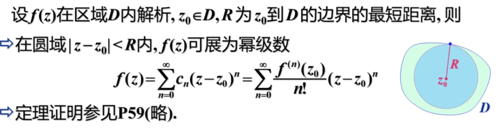
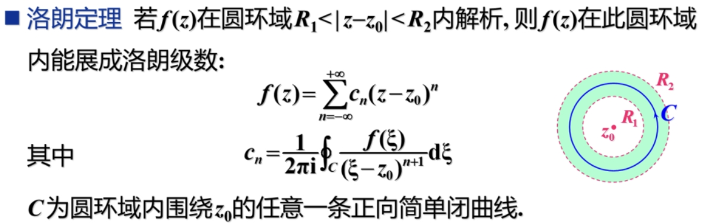
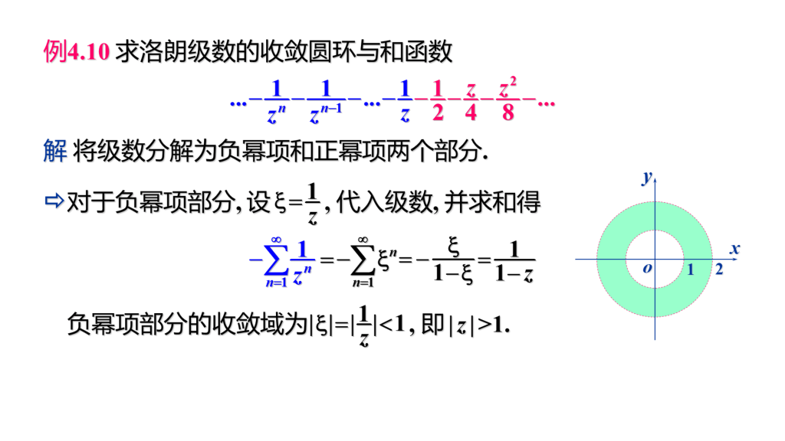
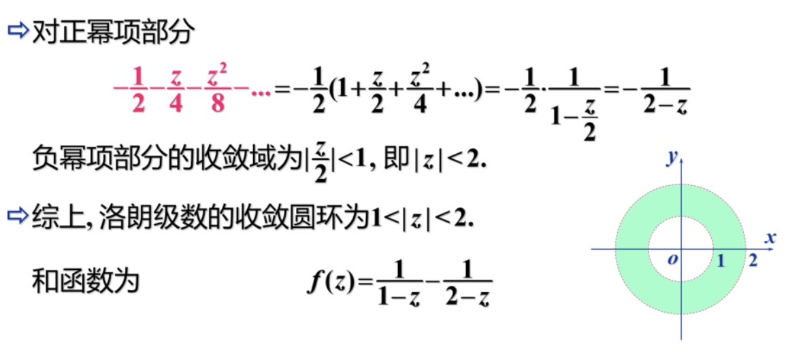

# 级数

### 0 总结

- 复数列收敛要求实部极限和虚部极限均收敛。

- 复数列收敛半径 $R = \dfrac{1}{\lambda}$（其中 $\lambda$ 可以用比值法或根值法算），复数列的收敛域构成一个收敛圆。

- 复数列可以泰勒展开，收敛域是一个收敛圆，收敛半径是到最近奇点的距离。

    !!! 常用幂级数展开
        \begin{gather*}
          \frac{1}{1-x} = \sum_{n = 0}^{\infty}x^{n},\ \frac{1}{1+x} = \sum_{n = 0}^{\infty}(-1)^nx^{n}\ (-1 < x < 1)
          \newline e^x = \sum_{n = 0}^{\infty}\frac{x^n}{n!}\ (-\infty < x < \infty)
          \newline \sin x = \sum_{n = 0}^{\infty}(-1)^n\frac{x^{2n+1}}{(2n+1)!}\ (-\infty < x < \infty)
          \newline \cos x = \sum_{n = 0}^{\infty}(-1)^n\frac{x^{2n}}{(2n)!}\ (-\infty < x < \infty)
          \newline \ln(1 + x) = \sum_{n = 0}^{\infty} (-1)^n\frac{x^{n + 1}}{n + 1}\ (-1 < x \le 1)
          \newline \arctan x = \sum_{n = 0}^{\infty} (-1)^n\frac{x^{2n + 1}}{2n + 1}\ (-1 \le x \le 1)
        \end{gather*}

- 复数列可以洛朗展开，其收敛域是收敛圆环，$\sum_{n = 0}^{\infty}c_n(z - z_0)^n = \sum_{n = 1}^{\infty}c_{-n}(z - z_0)^{-n} + \sum_{n = 0}^{\infty}c_n(z - z_0)^n$。且系数 $c_n$ 满足公式 $c_n = \dfrac{1}{2\pi i} \oint\dfrac{f(\xi)}{(\xi - z_0)^{n + 1}}d\xi$。

- 利用系数 $c_n$ 公式可以推导出 $\oint_C f(z)dz = 2\pi ic_{-1}$。（这里收敛圆环要满足所有奇点都在小圆内）

### 1 复级数

- 复数列

    $\{z_n\} = \{x_n + iy_n\}$ 是复数列，其极限判断以及四则运算与实数列相同。

- 复数项级数

    复数列所有项的和称为复数项级数，$\sum_{n = 1}^{\infty}z_n = z_1 + z_2 + \dots$

    级数收敛与发散的定义与实数级数相同。

    复数项级数收敛的**充要条件**是实部和虚部**都收敛**。

    复数项级数收敛的**必要条件**是 $\lim_{n \to \infty} z_n = 0$。

- 绝对收敛与条件收敛

    若 $\sum_{n = 1}^{\infty} |z_n|$ 收敛，则该复数列绝对收敛。

    不绝对收敛的收敛级数称为条件收敛。

- 判断复数项级数敛散性的方法

    实部虚部分开讨论或在一起直接判定。

    > 一些基本技巧可以用正项级数的判定技巧。

- 复变函数项级数

    设 $\{f_n(z)\}$ 是区域 $D$ 内的函数列，称 $\sum_{n = 1}^{\infty} f_n(z)$ 为复变函数项级数。

    若 $D$ 内有一点 $z_0$，满足 $\lim_{n \to \infty} S_n(z_0) = S(z_0)$，称 $z_0$ 是级数的收敛点。即 $S(z_0) = \sum_{n = 1}^{\infty}f_n(z_0)$。

    若级数在 $D$ 内处处收敛，则称 $S(z) = \sum_{n = 1}^{\infty}f_n(z)$ 为级数的和函数。

- 幂级数

    形如 $\sum_{n = 0}^{\infty}c_n(z - z_0)^n$ 的级数。

    

    由 $Abel$ 定理可知，必存在一个圆域，使得幂级数在圆域内绝对收敛，在圆域外发散。但对于圆周上的幂级数的敛散性要单独讨论。

    故我们可以定义圆周 $|z| = R$ 称为幂级数 $\sum_{n = 0}^{\infty}c_nz^n$ 的收敛圆，$R$ 称为收敛半径。

- 求幂级数收敛半径

    若 $\lim_{n \to \infty}|\dfrac{c_{n + 1}}{c_n}| = \lambda$ 或 $\lim_{n \to \infty} \sqrt[n]{|c_n|} = \lambda$，则可以得出 $R = \dfrac{1}{\lambda}$。

    > 注意这里 $c_n$ 是 $z^n$ 前面的系数。

- 例题

    

### 2 泰勒级数

- 泰勒展开定理

    

    !!! 有关泰勒展开的一些性质
        - 若 $f(z)$ 有奇点，则最近的奇点一定在 $f(z)$ 的收敛圆周上，即收敛半径就是到最近奇点的距离。

        - 函数在 $z_0$ 解析的充要条件是函数在 $z_0$ 点的领域内可展开成幂级数（解析函数的本质特征）。
  
        - 解析函数的幂级数展开式是唯一的，就是泰勒级数。

- 例题（有技巧地泰勒展开）

    

    

### 3 洛朗级数

- 洛朗级数

    形如 $\sum_{n = 0}^{\infty}c_n(z - z_0)^n = \sum_{n = 1}^{\infty}c_{-n}(z - z_0)^{-n} + \sum_{n = 0}^{\infty}c_n(z - z_0)^n$ 的级数称为洛朗级数。

    当 $c_{-n} = 0(n = 1, 2, \dots)$ 时，洛朗级数就是幂级数。

- 洛朗级数的收敛圆环

    洛朗级数分为正幂项和负幂项，正幂项称为洛朗级数的解析部分，负幂项称为洛朗级数的主要部分。

    若两部分在 $z_0$ 处都收敛，则称洛朗级数在 $z_0$ 处收敛。

    

    

- 洛朗定理

    

    > 同一解析圆环内，$f(z)$ 的洛朗展开式是唯一的（即 $c_n$ 相同）。

    将函数展开为洛朗级数一般有直接法和间接法。

    > 直接法可以直接用洛朗定理（套公式），然后用高阶函数求导公式来求。
    >
    > 间接法，利用一些技巧间接转化。**比如 $f(z) = (z - z_0)^kg(z)$，可以先将 $g(z)$ 洛朗展开，然后在乘起来，得出 $f(z)$ 的洛朗级数。还有 $\dfrac{1}{1 - z} = \sum_{n = 0}^{\infty}z^n(|z| < 1)$ 也是一个常用转化公式。**

- 例题

    

    > 注意学习这里的技巧，如果 $\dfrac{1}{1 - z}$ 里 $z < 1$，那么直接用公式 $\dfrac{1}{1 - z} = \sum_{n = 0}^{\infty}z^n(|z| < 1)$，如果 $z > 1$，就进行转化 $\dfrac{1}{1 - z} = \dfrac{1}{z}\cdot\dfrac{1}{\dfrac{1}{z} - 1}$，然后对后面套公式即可。

- 积分计算公式

    

### 4 例题

- $\dfrac{1}{(z - a)(z - b)}$ 展开成 $z$ 的幂级数，并指出收敛域。

    

    

- $\dfrac{1}{(1 + z^2)^2}$ 展开成 $z$ 的幂级数，并指出收敛域。

    

- $\sin^2z$ 展开成 $z$ 的幂级数，并指出收敛域。

    

- $\dfrac{z}{(z + 1)(z + 2)},z_0 = 2$ 求该函数在 $z_0$ 的泰勒展开。

    

- $\dfrac{1}{z^2},z_0 = -1$ 求该函数在 $z_0$ 的泰勒展开。

    

- $\dfrac{1}{4 - 3z},z_0 = 1 + i$ 求该函数在 $z_0$ 的泰勒展开。

    

- $\dfrac{1}{(z - 1)(z - 2)},0 < |z - 1| < 1;1 < |z - 2| < +\infty$ 求该函数在指定圆环内的泰勒展开。

    

- $\dfrac{1}{z^2(z - i)}$，以 $z_0$为中心的圆环域。 求该函数在指定圆环内的泰勒展开。

    

    

- 利用积分公式来算下题

    

- 根据洛朗展开倒推收敛圆环与和函数

    

    
