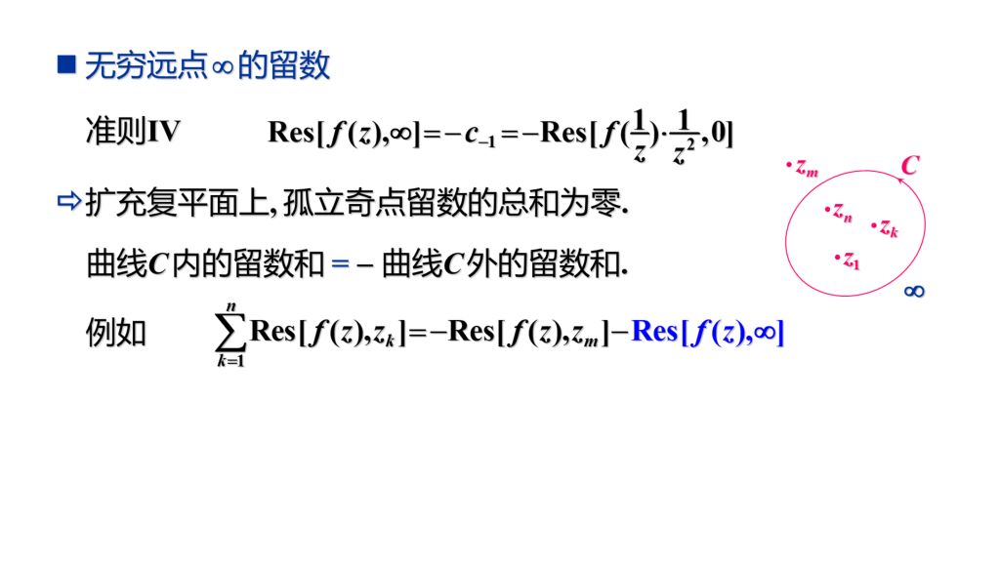
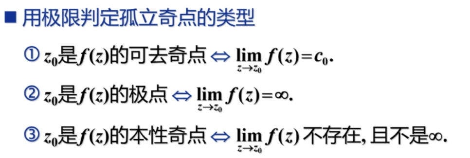
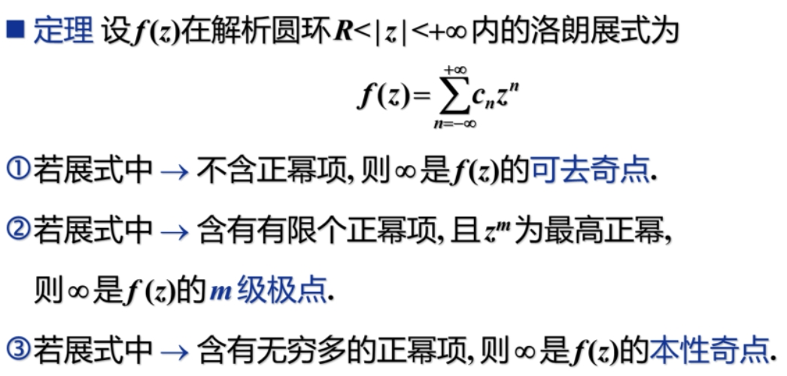
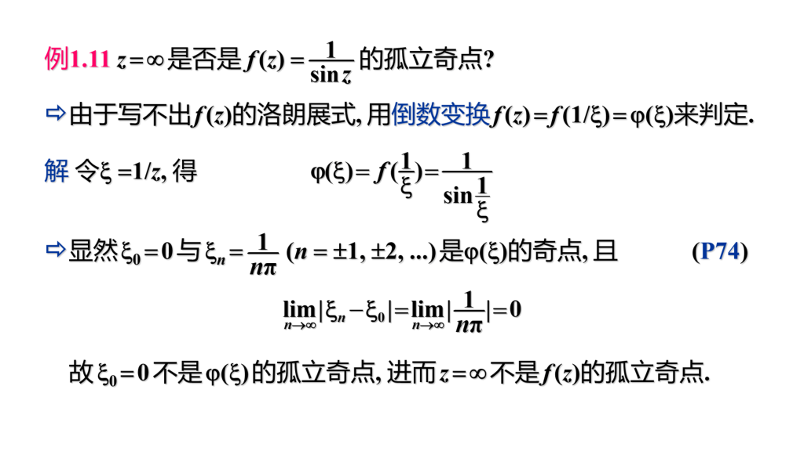
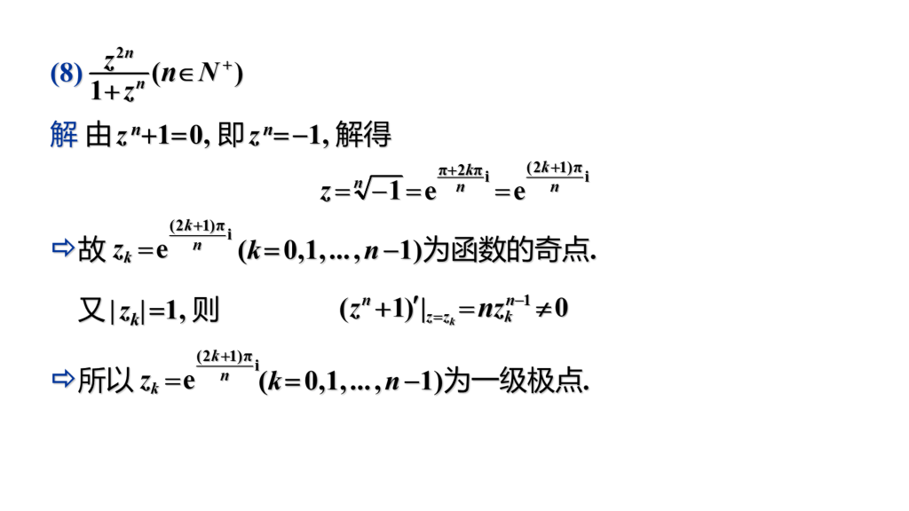
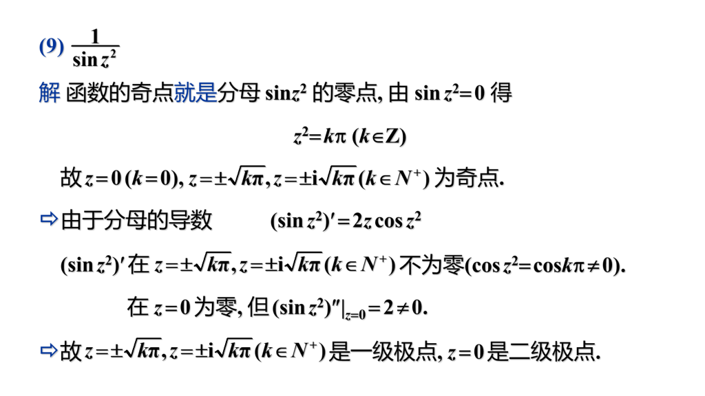

# 第五章 留数

## 第五章总结

> 一级极点用法则一，多极用法则二，复杂分式（且分母好求导）考虑法则三，无穷用法则四。判断无穷的性质就是转化为判断零处的性质。

## 1 孤立奇点

- 孤立奇点

    若 $z_0$ 为奇点，且 $z_0$ 邻域内没有奇点，则 $z_0$ 是孤立奇点。

    若 $z_0$ 是孤立奇点，则必存在去心邻域 $0 < |z - z_0| < \delta$，$\delta$ 取决于 $z_0$ 到其他奇点的最小距离。

- 孤立奇点的分类

    在孤立奇点的解析邻域内，$f(z)$ 可以进行洛朗展开。根据洛朗展开式中负幂项的多少，把孤立奇点分为三类。

    - **可去奇点：**展开式中不含负幂项。
    - **极点：**展开式中有有限个负幂项。
    - **本性奇点：**展开式中有无限个负幂项。

- 可去奇点的判定

    若 $f(z)$ 在 $z_0$ 的去心邻域内解析，则 $z_0$ 是 $f(z)$ 可去奇点的充要条件是 $\lim_{z \to z_0} f(z) = c_0$。

- 极点

    若 $f(z)$ 在 $z_0$ 的去心邻域内，洛朗展开式中幂次最小的是 $-m$ 次幂，则称 $z_0$ 为 $f(z)$ 的 $m$ 级极点。

    

    

- 例题

    

- 孤立奇点类型的判断方法

    

- 函数的零点与极点的关系

    若不恒等于 $0$ 的解析函数 $f(z)$ 在 $z_0$ 的邻域内可表示为 $f(z) = (z - z_0)^mg(z)$，其中 $g(z)$ 在 $z_0$ 解析且 $g(z_0) \ne 0$，则称 $z_0$ 为 $f(z)$ 的 $m$ 级零点。

    **零点级数的判定：**若 $f(z)$ 在 $z_0$ 解析，则 $z_0$ 为 $f(z)$ 的 $m$ 级零点的充要条件是 $f^{(k)}(z_0) = 0(k = 0, 1, \dots, m - 1)$ 且 $f^{(m)}(z_0) \ne 0$。

    **零点与极点的关系：**若 $z_0$ 是 $f(z)$ 的 $m$ 级极点，则 $z_0$ 是 $\dfrac{1}{f(z)}$ 的 $m$ 级零点。同样的，若 $z_0$ 是 $f(z)$ 的 $m$ 极零点，则 $z_0$ 是 $\dfrac{1}{f(z)}$ 的 $m$ 级极点。

    > 其实就是看分母的式子在 $z_0$ 上是几重跟就是几重零点。

- 分式的零点与极点

    

    > **虽然函数的极点级数难以确定，但是零点级数好确定，尤其是分式，可以拆成分子分母来讨论。所以我们可以利用零点级数来求极点级数。**

- 函数在无穷远点的性态

    

    若判断函数在 $\infty$ 点处的性态，可以令 $\xi = \dfrac{1}{z}$，故 $f(z)$ 在 $\infty$ 的性态则变为 $\phi(\xi)$ 在 $0$ 处的性态。经过一系列推到之后，得到如下定理：

    

- 例题

    

    > 如果函数可以进行洛朗展开，则直接用洛朗展开然后判断正幂项次数。但对于无法洛朗展开的函数，可以用定义法来解决。

## 2 留数
  由前面的 $\oint_C f(z)dz = 2\pi i c_{-1}$，可知 $c_{-1}$ 很重要，我们称之为留数。

  

- 留数定理

    函数沿闭曲线的正向积分等于所有奇点的留数和乘以 $2\pi i$

    若 $z_0$ 是 $f(z)$ 的可去奇点，则留数 $c_{-1} = 0$。

    若 $z_0$ 是 $f(z)$ 的本性奇点，则只能用洛朗展开求 $c_{-1}$。

    若 $z_0$ 是 $f(z)$ 的极点，则可以用以下四个法则来相对简便求留数。

    > 法则一：若 $z_0$ 是 $f(z)$ 的一级极点，则 $\mathrm{Res}[f(z), z_0] = \lim_{z \to z_0}(z - z_0)f(z)$。
    >
    > 法则二：若 $z_0$ 是 $f(z)$ 的 $m$ 级极点，则 $\mathrm{Res}[f(z), z_0] = \dfrac{1}{(m - 1)!}\lim_{z \to z_0}\dfrac{d^{m - 1}}{dz^{m - 1}}[(z - z_0)^mf(z)]$。
    >
    > 法则三：设 $f(z) = \dfrac{P(z)}{Q(z)}$，$P(z)$ 和 $Q(z)$ 在 $z_0$ 解析，若 $P(z_0) \ne 0,Q(z_0) = 0, Q'(z_0) \ne 0$，则 $z_0$ 为 $f(z)$ 的一级极点且 $\mathrm{Res}[f(z), z_0] = \dfrac{P(z_0)}{Q'(z_0)}$。
    >
    > 法则四：无穷远点 $\infty$ 的留数 $\mathrm{Res}[f(z), \infty] = -c_{-1} = -\mathrm{Res}[f(\dfrac{1}{z})\cdot \dfrac{1}{z^2}, 0]$。（我们利用这条法则，当内部积分不好算时，可以转化为外部的积分和来算）
    >
    > **注：$\infty$ 一定是奇点，但不能判断奇点类型。**

- 无穷远点的留数

    

    > **注：$\infty$ 一定是奇点，但不能判断奇点类型。**
    >
    > 推论：若 $f(z)$ 在$R < |Z| < +\infty$ 内的洛朗展开为 $f(z) = \sum_{-\infty}^{+\infty} c_nz^n$，则 $\mathrm{Res}[f(z), +\infty] = -c_{-1}$。

    **定理：若 $f(z)$ 在扩充复平面上，包括 $\infty$ 在内只有有限个孤立奇点，则 $f(z)$ 所有奇点的留数总和为零。**

    > **判断无穷的性质就是转化为判断零处的性质**。

- 例题

    

    > 注意这里解法二，$m$ 确实取任一大于等于 $3$ 的数即可（洛朗展开之后可以看出）。

    

    

    

## 3 习题课

- 求下列函数奇点，若是极点则确定级数

    

    

    > 确定奇点的取值之后，若是在分母上，可以通过不断求导判断是几级零点，然后就可以判断出是几级极点。

- 利用留数计算积分

    

    

- 判断 $\infty$ 的奇点类型并求出 $\infty$ 的留数

    

- 利用外面算里面

    

    