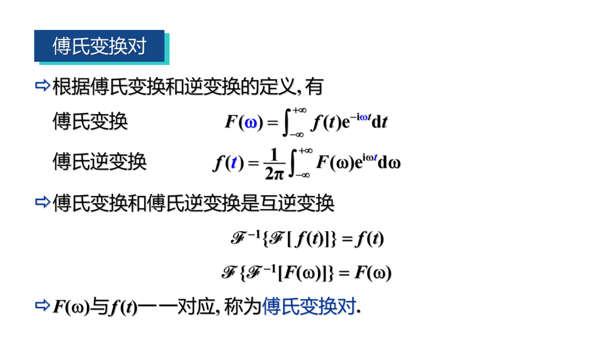

# 第六章 傅里叶变换

## 0 总结

## 1 傅里叶级数

- 傅里叶级数

    

    

- 复指数形式的傅里叶级数

    将欧拉公式代入到上式子，可以得到：

    

## 2 傅里叶积分与傅里叶变换

- 傅里叶积分定理

    

- 傅里叶变换

    将上式积分式子进行变换，得到如下：

    

    

- 例题

    

    

## 3 单位脉冲函数

- 单位脉冲函数

    满足下列两个条件的函数 $\delta(t)$ 
      
    $$
      \begin{align*}
        & \delta(t) = \left\{\begin{matrix}
                        0  & t = 0\\
                        \infty  & t \ne 0
                          \end{matrix}\right.  \\
        & \int_{-\infty}^{+\infty} \delta(t)dt = 1
      \end{align*}
    $$

    称为单位脉冲函数。

-  $\delta$ 的性质

    $$
      \begin{align*}
        & \int_{-\infty}^{+\infty}\delta(t)\varphi(t)dt = \varphi(0)  \\
        & \int_{-\infty}^{+\infty}\delta(t - t_0)\varphi(t)dt = \varphi(t_0)
      \end{align*}
    $$

- $\delta$ 函数的傅氏变换

    $$
      \begin{align*}
        & \mathscr{F}[\delta(t)] = 1  \\
        & \mathscr{F}[\delta(t - t_0)] = e^{-i\omega t_0} 
      \end{align*}
    $$

    > 这两个傅氏变换对很重要，很多题目重要需要靠这两个不断变换。

- 例题

    

    

    

## 4 傅里叶变换的性质

- 线性性质

    $$
    \begin{gather*}
    F_1(\omega) = \mathscr{F}[f_1(t)],F_2(\omega) = \mathscr{F}[f_2(t)] \\
    \Rightarrow \mathscr{F}[\alpha f_a(t) + \beta f_2(t)] = \alpha F_1(\omega) + \beta F_2(\omega)
    \end{gather*}
    $$
  
    逆变换同理成立。
  
- 平移性质

    $$
    \begin{gather*}
    F(\omega) = \mathscr{F}[f(t)] \\
    \Rightarrow \mathscr{F}[f(t - t_0)] = e^{-i\omega t_0}F(\omega) ,\\
    \mathscr{F}^{-1}[F(\omega - \omega_0)] = e^{i\omega t_0}f(t)
    \end{gather*}
    $$
  
- 伸缩性质

    $$
    \begin{gather*}
    F(\omega) = \mathscr{F}[f(t)] \\
    \Rightarrow \mathscr{F}[f(at)] = \dfrac{1}{|a|}F(\dfrac{\omega}{a})
    \end{gather*}
    $$
  
- 微分性质

    $$
    \begin{gather*}
    若 \lim_{|t| \to +\infty}f(t) = 0, 则 \mathscr{F}[f'(t)] = i\omega \mathscr{F}[f(t)] \\
    若 \lim_{|t| \to +\infty}f^{(k)}(t) = 0, 则 \mathscr{F}[f^{(n)}(t)] = (i\omega)^n \mathscr{F}[f(t)]
    \end{gather*}
    $$
  
- 积分性质

    $$
    \begin{gather*}
    若\ \  g(t) = \int_{-\infty}^t f(\tau)d\tau,\lim_{t \to +\infty} g(t) = 0,则 \\
    \mathscr{F}[g(t)] = \dfrac{1}{i\omega}\mathscr{F}[f(t)]
    \end{gather*}
    $$

    > 其实就是求导倒过来的式子。
  
- 卷积与卷积定理

    $f_1(t)$ 与 $f_2(t)$ 的卷积记为 $f_1(t) \ast f_2(t) = \int_{-\infty}^{+\infty}f_1(\tau)f_2(t - \tau)d\tau$。

    且卷积满足交换律，结合律和分配律。

    **卷积定理**

    $$
    \begin{gather*}
    F_1(\omega) = \mathscr{F}[f_1(t)],F_2(\omega) = \mathscr{F}[f_2(t)] \\
    \Rightarrow \mathscr{F}[f_1(t) * f_2(t)] = F_1(\omega) \cdot F_2(\omega) \\
    推论 \Rightarrow \mathscr{F}[f_1(t) \cdot f_2(t)] = \dfrac{1}{2\pi} F_1(\omega) * F_2(\omega)
    \end{gather*}
    $$

## 5 习题课

