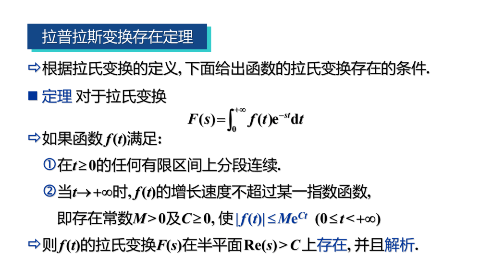
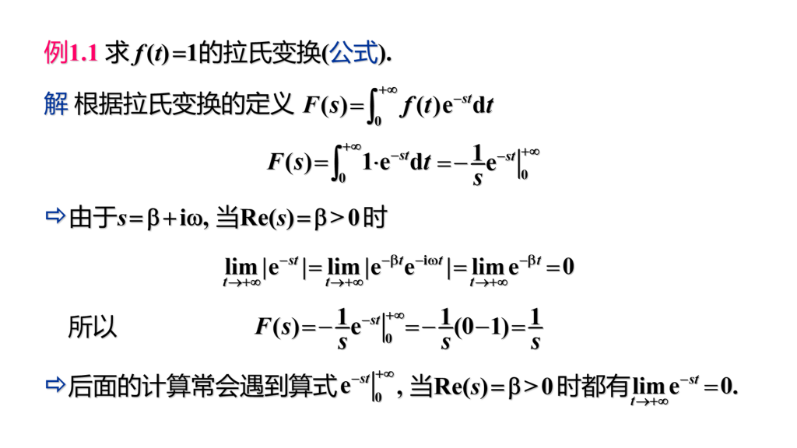
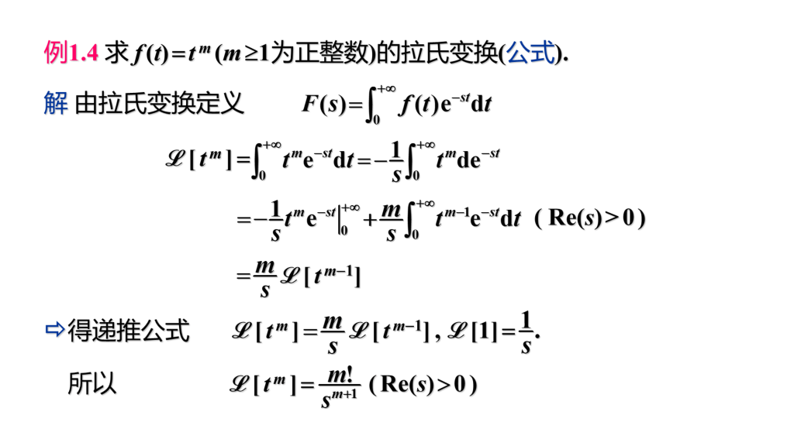
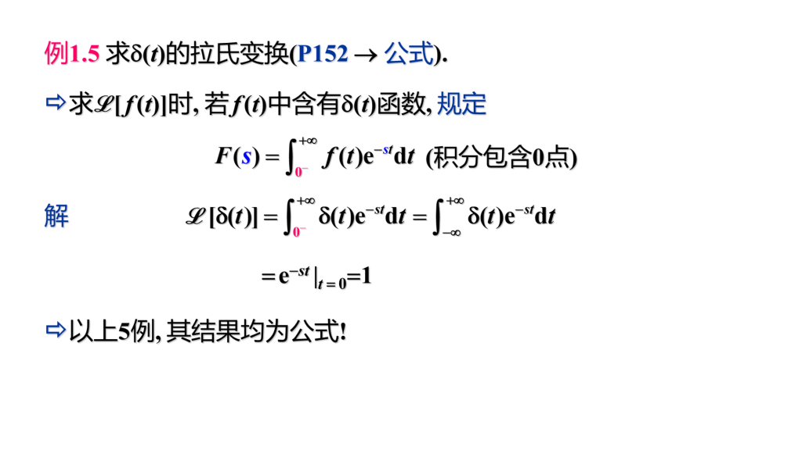
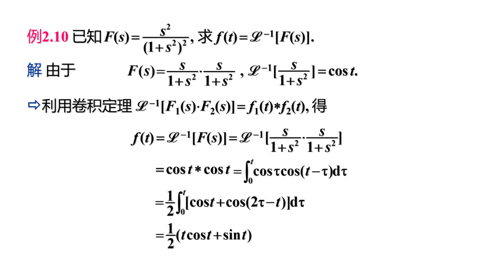
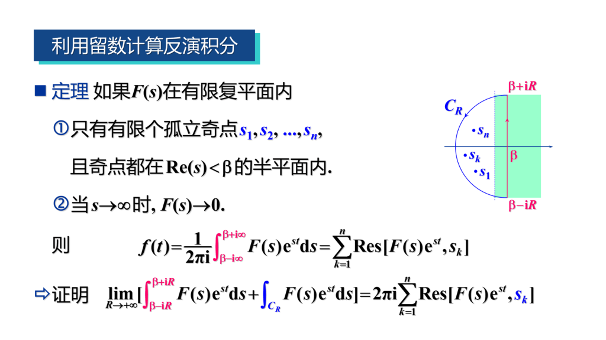
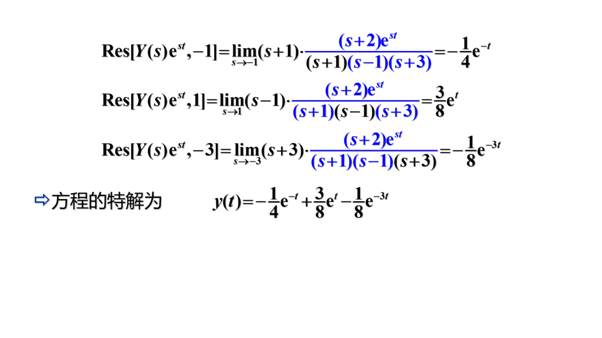

# 第七章 拉普拉斯变换

## 0 总结

## 1 拉普拉斯变换的概念

- 拉普拉斯变换

    

    

- 拉普拉斯变换存在的条件

    

- 重要公式 & 例题

    

    

    

    

    

## 2 拉普拉斯变换的性质

- 线性性质

    $$
    \begin{gather*}
      F_1(\omega) = \mathscr{L}[f_1(t)],F_2(\omega) = \mathscr{L}[f_2(t)] \\
      \Rightarrow \mathscr{L}[\alpha f_a(t) + \beta f_2(t)] = \alpha F_1(\omega) + \beta F_2(\omega)
    \end{gather*}
    $$

    逆变换同理
  
- 微分性质

    $$
    \begin{gather*}
      F(s) = \mathscr{L}[f(t)] \Rightarrow \mathscr{L}[f'(t)] = sF(s) - f(0)\\
      一般地，有\ \ \mathscr{L}[f^{(n)}(t)] = s^nF(s) - s^{n - 1}f(0) - s^{n - 2}f'(0) - \dots - sf^{(n - 2)}(0) - f^{(n - 1)}(0) \\
      F(s) = \mathscr{L}[f(t)] \Rightarrow F'(s) = -\mathscr{L}[tf(t)] \Rightarrow 则\ f(t) = \dfrac{1}{t}\mathscr{L}[-F'(s)] \\
      一般地，有\ \ F^{(n)}(s) = (-1)^n\mathscr{L}[t^nf(t)]
    \end{gather*}
    $$
  
- 积分性质

    $$
    \begin{gather*}
      F(s) = \mathscr{L}[f(t)] \Rightarrow \mathscr{L}[\int_0^t f(t)dt] = \dfrac{1}{s} F(s) \\
      F(s) = \mathscr{L}[f(t)] \Rightarrow \mathscr{L}[\dfrac{f(t)}{t}] =  \int_{0}^{+\infty} \dfrac{f(t)}{t} e^{-st}dt = \int_{s}^{\infty}F(s)ds \\
      或 f(t) = t\mathscr{L}^{-1}[\int_s^{+\infty}F(s)ds]
    \end{gather*}
    $$
  
- 位移性质

    $$
      设 F(s) = \mathscr{L}[f(t)]， a 为复常数，则 \mathscr{L}[e^{at}f(t)] = F(s - a)
    $$
  
- 延迟性质

    $$
      若\ t < 0\ 时\ f(t) = 0，且\ F(s) = \mathscr{L}[f(t)]，则对任意非负实数\ \tau，有\ \mathscr{L}[f(t - \tau)] = e^{-s\tau}F(s)
    $$

    值得注意的是，

    

- 计算反常积分

    

- 卷积及卷积定理

    
  
    
  
- 例题

    

    

    

    

    

    

    

    

## 3 拉普拉斯逆变换

$$
\begin{gather*}
    \mathscr{L}^{-1}[F(s)] = f(t) \\
    求解拉普拉斯变换的逆变换，又称为拉氏变换的反演。
\end{gather*}
$$

- 反演积分公式

    $f(t) = \dfrac{1}{2\pi i }\int_{\beta - i\infty}^{\beta + i\infty}F(s)e^{st}ds$ 这个公式是拉式逆变换的一般公式，称为反演积分公式。

    

- 利用留数计算反演公式
    

    

- 例题

    > 求拉式逆变换既可以用留数来做，也可以拆分成熟悉的函数来做。

    

    

## 4 用拉氏变换解常微分方程

- 微分方程的拉氏变换解法

    > 由于直接对微分方程运算比较困难，所以我们可以先对两边进行拉普拉斯变换，求出 $F(s)$ 的表达式，然后再可以用留数法求出逆变换。

    

- 例题

    

    

    

## 5 习题课
