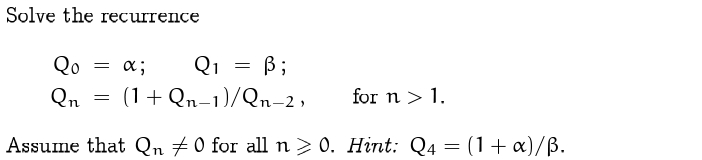
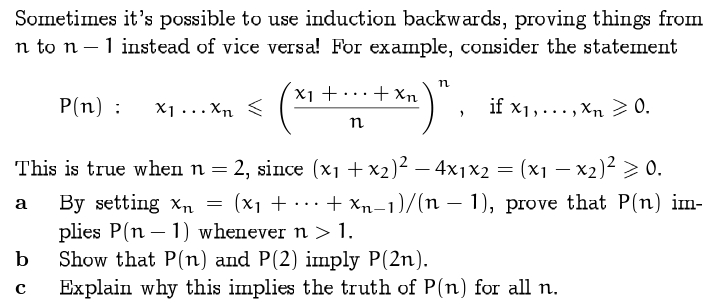
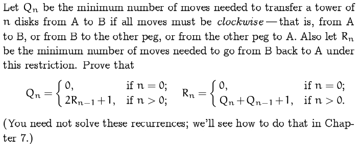
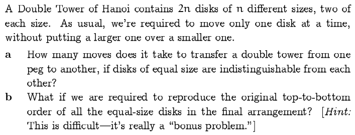
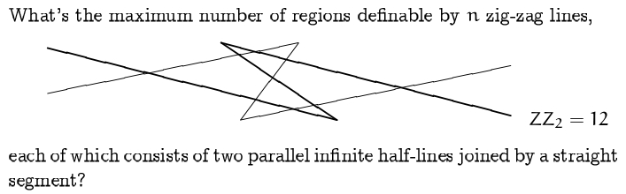
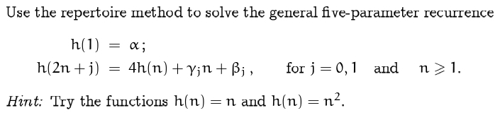
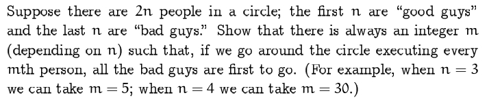

# Recurrent Problems

## 0x00. Note

对于 n 条直线划分区域个数 $L_n$，满足 $L_n = L_{n - 1} + n = S_n + 1 = \dfrac{1}{2}n(n + 1) + 1$。
其中 $S_n$ 也被称为三角数。

对于 n 条折线划分区域个数 $Z_n$，可以看作是两条直线，然后每两条直线（即一个折线）切割的区域少了 2 个，满足 $Z_n = L_{2n} - 2n = 2n^2 - n + 1$。

## 0x01. Exercise
### Exercise 8

??? success "Solution"
    $Q_0 = \alpha, Q_1 = \beta, Q_2 = \dfrac{1 + \beta}{\alpha}, Q_3 = \dfrac{1 + \alpha + \beta}{\alpha\beta}, Q_4 = \dfrac{1 + \alpha}{\beta}, Q_5 = \alpha, Q_6 = \beta$

    呈周期变换。
    

### Exercise 9

??? success "Solution"
    **a.** 把 $x_n = \dfrac{\sum x_{n - 1}}{n - 1}$ 代入公式即可推出。

    **b.** 
        \begin{eqnarray}
        (x_1x_2...x_n)(x_{n + 1}x_{n + 2}...x_{2n}) \le \left (\dfrac{x_1 + x_2 + ... + x_n}{n}\right )^n \left (\dfrac{x_{n + 1} + x_{n + 2} + ... + x_{2n}}{n}\right )^n \newline \le \left (\left (\dfrac{x_1 + x_2 + ... + x_n + x_{n + 1} + x_{n + 2} + ... + x_{2n}}{2n}\right )^2\right )^n
        \end{eqnarray}
        

    **c.** 所有的二的幂次都可以满足，然后小于二的幂次的也都能满足。

### Exercise 10 

??? success "Solution"  
    设从左到右依次为 A，B，C。那么对于从 A -> B 移走 n 个，一定是 A -> C 移走 n - 1 个，A -> B 移走一个，然后 C -> B 移走 n - 1 个。故 $Q_n = R_{n - 1} + 1 + R_{n - 1}$。

    那么对于从 B -> A 移走 n 个，一定是 B -> A 移走 n - 1 个，B -> C 移走一个，然后 A -> B 移走 n - 1 个，C -> A 移走一个，然后 B -> A 移走 n - 1 个。故 $R_n = R_{n - 1} + 1 + Q_{n - 1} + 1 + R_{n - 1}$。带入先前的 $Q_n$ 可得 $R_n = 2R_{n - 1} + 2 + Q_{n - 1}$。

### Exercise 11

??? success "Solution"
    **a.** $A_n = 2A_{n - 1} + 2 = 2^{n + 1} - 2$

    **b.** 虽然不太会严格的证明，但是可以大致知道是如何操作的。结合 a 的操作，我们发现，a 操作完之后相邻两个盘子都互换了位置，那么操作两次之后就可以换回来。所以我们应该尽可能进行限制少的操作（即 a 操作），这样步数才会少。所以具体操作是从 A -> B 移走 n - 1 对（反），一定是 A -> C 移走 1 对（反），B -> A 移走 n - 1 对（正），然后 C -> B 移走 1 对（正），最后要保持顺序不变地把 n - 1 对从 A 移到 B。故 $B_n = A_{n - 1} + 2 + A_{n - 1} + 2 + B_{n - 1}$。其实也可以看作 $B_n = A_{n - 1} + 1 + A_{n - 1} + 1 + A_{n - 1} + 1 + A_{n - 1}$。则有 $B_n = 2^{n + 2} - 5$，确实无法构造出更小的方案。
    

### Exercise 12

??? success "Solution"
    递推公式：$R_n = 2R_{n - 1} + m_n$。

    通项：$R_n = 2^{n - 1}m_1 + ... + 2m_{n - 1} + m_n$。

### Exercise 13

??? success "Solution"  
    **先给出一个神秘结论：如果对于某种划分，新加入的线产生了 k 个交点，那么则会产生 k + 1 个新区域。
    这个结论对于直线，折线和本题均适用。**

    对于每个 zig-zag，我们可以用充分长的极狭窄的折线代替，这样对于每次新增的 zig-zag，它都会对之前另外某个 zig-zag 产生 9 个点，那么一共可以产生 9(n - 1) 个点，故可产生 9(n - 1) + 1 个新区域。则有 $ZZ_n = ZZ_{n - 1} + 9(n - 1) + 1 = 9S_n - 8n + 1 = \dfrac{9}{2}n^2 - \dfrac{7}{2}n + 1$。

**Exercise 14** 

**Exercise 15** 

### Exercise 16

??? success "Solution"  
    设 $g(n) = A(n)\alpha + B(n)\gamma + C(n)\beta_0 + D(n)\beta_1$，我们令 $\gamma = 0$，则有 $g((1b_1b_2...b_m)_2) = (\alpha\beta_{b_1}\beta_{b_2}...\beta_{b_m})_3$，那么有 $A(n)\alpha + C(n)\beta_0 + D(n)\beta_1 = (\alpha\beta_{b_1}\beta_{b_2}...\beta_{b_m})_3$，分别令其中一个变量为 $1$，另外两个为 $0$ 即可求出 $A(n)$，$C(n)$，$D(n)$ 的通项。

    然后再令 $g(n) = n$，可以得出 $A(n) - B(n) + D(n) = n$，故也可以求出 $B(n)$ 通项。

**Exercise 17** 

**Exercise 18** 

**Exercise 19** 

### Exercise 20

??? success "Solution"  
    设 $g(n) = A(n)\alpha + B(n)\gamma_0 + C(n)\gamma_1 + D(n)\beta_0 + E(n)\beta_1$，我们令 $\gamma_1 = \gamma_0 = 0$，则有 $g((1b_1b_2...b_m)_2) = (\alpha\beta_{b_1}\beta_{b_2}...\beta_{b_m})_4$，那么有 $A(n)\alpha + D(n)\beta_0 + E(n)\beta_1 = (\alpha\beta_{b_1}\beta_{b_2}...\beta_{b_m})_4$，分别令其中一个变量为 $1$，另外两个为 $0$ 即可求出 $A(n)$，$D(n)$，$E(n)$ 的通项。

    然后再令 $g(n) = n$，可以得出 $A(n) - 2B(n) - 2C(n) + E(n) = n$；令 $g(n) = n^2$，可以得出 $A(n) + 4C(n) + E(n) = n^2$，故也可以求出 $B(n)$ 和 $C(n)$ 通项。

**Exercise 21** 

