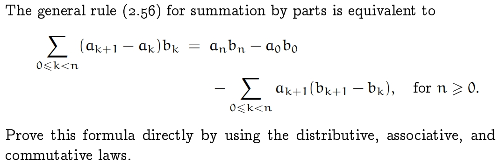
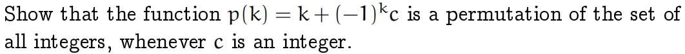
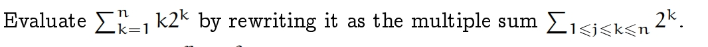
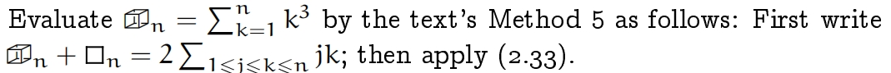
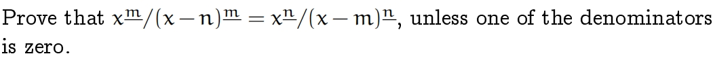
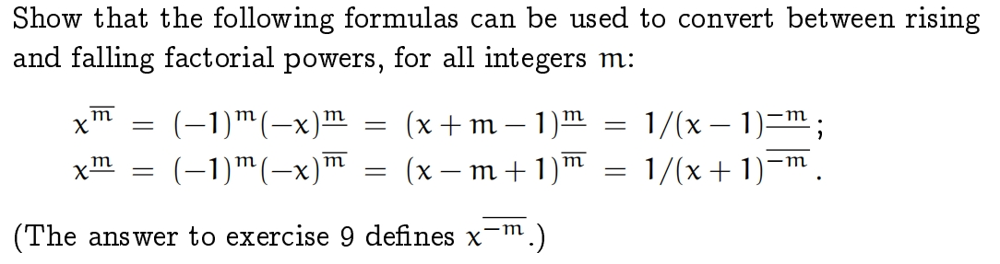
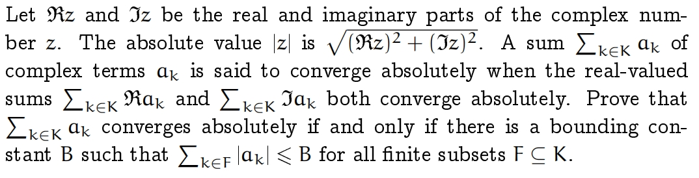
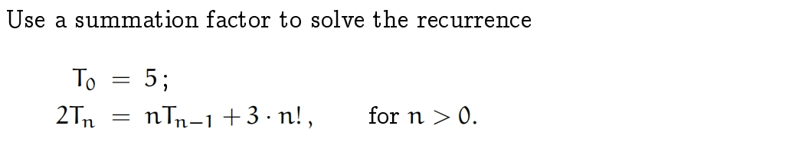
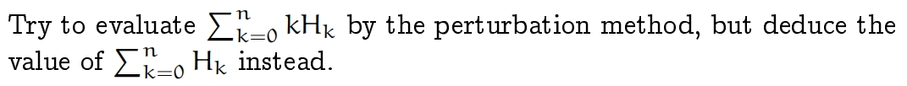

# Sums

## 0x00. Note

## 0x01. Exercise

**Exercise 11**

!!! success "Solution"
    
    

**Exercise 12**

**Exercise 13**

**Exercise 14** 

**Exercise 15** 

**Exercise 16**

**Exercise 17** 

**Exercise 18** 

**Exercise 19** 

**Exercise 20**

