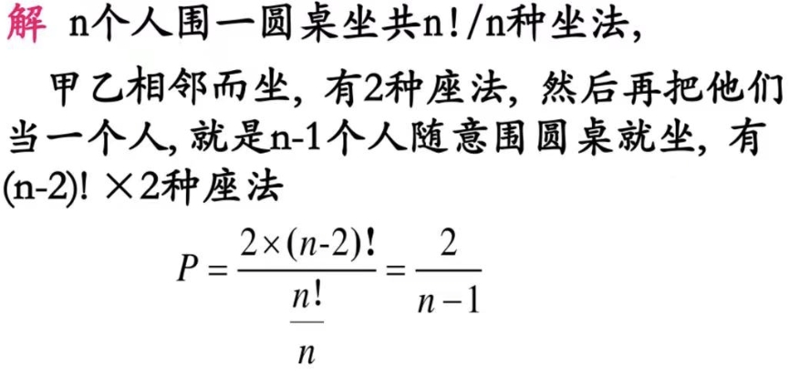
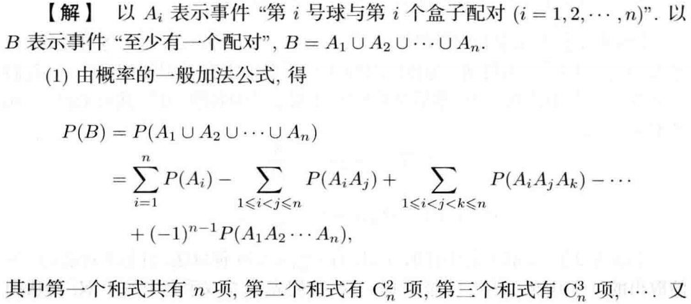
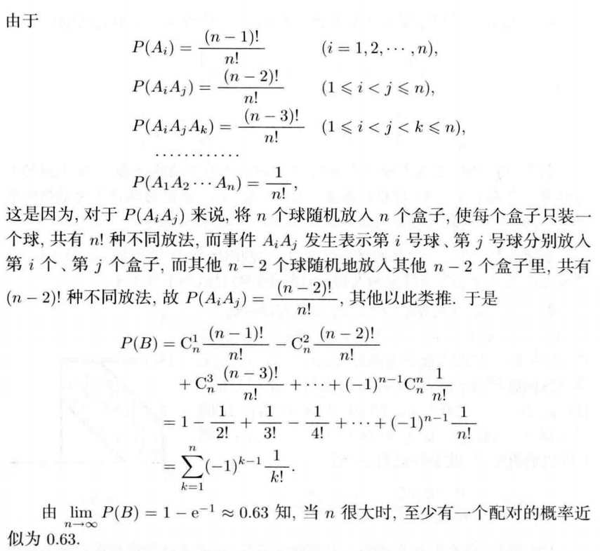
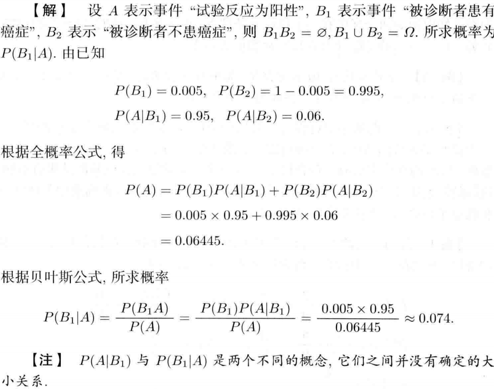
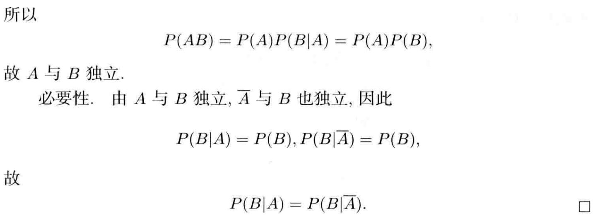

# 随机事件及其概率论

## 1 随机试验与随机事件

### 1.1 基本概念

  - 我们通常用字母 $E$ 表示一个随机试验。随机试验 $E$ 的基本结果称为样本点，用 $\omega$ 表示。称随机试验 $E$ 的所有基本结果的集合为样本空间，用 $\Omega =\{\omega \}$ 表示。
  - 样本空间 $\Omega$ 的部分子集称为随机试验 $E$ 的随机事件 $A$，若试验结果 $\omega \in A$，则称事件 $A$ 发生。
  - 由一个样本点组成的事件称为基本事件。必然发生的事件称为必然事件，不可能发生事件称为不可能事件。
  - 有限的样本点的空间称为有限样本空间，无限的样本点的空间称为无限样本空间。

### 1.2 事件关系

  - 当 $A$ 发生时 $B$ 一定发生，则 $B$ 包含事件 $A$，记作 $A \subseteq B$。
  - 相互包含的事件称为事件相等，记作 $A=B$。
  - $A$，$B$ 不能同时发生称为互不相容。
  - $A$，$B$ 事件中必有一个发生且不能同时发生称为事件的互逆，它们是 互逆 / 对立 的。其中一个事件是另一个事件的逆事件。记作 $\bar A = B$。显然 $\bar{\bar A} = A$。

### 1.3 随机事件的运算

  - 事件的交，说明两个事件中至少发生一个事件，又称为$A$，$B$ 事件的并事件或和事件，记作 $A \cup B$。

  - 事件的并，说明两个事件中都发生，又称为 $A$，$B$ 事件的交事件或积事件，记作 $A \cap B$。

  - 事件的差，事件 $A$ 发生而 $B$ 不发生，记作 $A-B$。

      > $$
      > A - B = A\bar B = A - AB \\ 
      > (A - B) \cup B = A \cup B
      > $$

  - 集合的运算满足结合律，交换律，分配律。这里着重强调一下对偶率。写作 $\bar{A \cup B} = \bar{A}\bar{B}$，$\bar{AB}=\bar A \cup \bar B$。

### 1.4 几个常见结论

$$
  \begin{gather*}
  A - B = A - AB = A \bar B \\
  A \cup B = A \cup (B-A) = A\cup(B - AB) \\
  A = A\Omega = A(B\cup \bar B) = AB\cup A\bar B
  \end{gather*}
$$  

## 2 随机事件的概率

### 2.1 频率 & 概率

  - 频（概）率有非负性；对于必然事件，其频（概）率是 $1$；对于**互不相容**的事件，频（概）率具有可加性。

  - 频率随试验次数的增加趋于稳定，其稳定值作为事件的概率。

  - 对于任一事件，有 $P(\bar A) = 1 - P(A)$。

  - **若 $A \subseteq B$**，则有 $P(B - A) = P(B) - P(A)$。

  - 对于**任意事件**，有 $P(B - A) = P(B) - P(AB)$。

  - 对于**任意事件**，有 $P(A \cup B) = P(A) + P(B) - P(AB)$。

    > 该公式推广到 $n$ 的情况即是容斥定理。

### 2.2 古典概型

- 基本特点：样本空间只含有限个点且每个样本点的出现是等可能的。称为等可能概型，也称古典概型。

### 2.3 几何概型

$P(A) = \dfrac{A 的度量}{\omega 的度量}$

## 3 条件概率
- 事件 A 在事件 B 发生下发生的概率是 $P(B | A) = \dfrac{P(AB)}{P(A)}$。
- 对于两两不相容事件，有 $P((\bigcup_{i = 1}^{\infty}B_i) | A) = \sum_{i = 1} ^ {\infty}P(B_i | A)$。
- 常见公式有 
    $P(\Phi | A) = 0$
    $P(\bar B | A) = 1 - P(B | A)$
    $P((B_1 \cup B_2) | A) = P(B_1 | A) + P(B_2 | A) - P((B_1B_2) | A)$
- 乘法公式 $P(AB) = P(A | B)P(B) = P(B | A)P(A)$
    推广 $P(ABC) = P(A)P(B | A)P(C | AB)$
        $P(A_1A_2 \dots A_n) = P(A_1)P(A_2 | A_1)P(A_3 | A_1A_2) \dots P(A_n | A_1A_2 \dots A_n)$
- 全概率公式
    若事件 $A_1$，$A_2$，$\cdots$，$A_n$ 满足两两互不相容且 $A_1 \cup A_2 \cup \dots A_n = \Omega$，那么称 $A_1$，$A_2$，$\cdots$，$A_n$ 为样本空间的一个**分解**或**完全事件组**。则对于事件 $B$，有 $P(B) = \sum_{i = 1}^n P(B | A_i)P(A_i)$。
- 贝叶斯公式
    将乘法公式带入全概率公式可得 $P(A_i | B) = \dfrac{P(B | A_i)P(A_i)}{\sum_{j = 1}^n P(B | A_j)P(A_j)}$（分子表示 $BA_i$ 发生的概率，分母表示 $B$ 发生的概率）。
    贝叶斯公式称为后验概率公式，其中为 $P(A_i | B)$ 后验概率，$P(A_i)$ 为先验概率。

## 4 事件的独立性

- 若有事件 $A$，$B$ 满足 $P(AB) = P(A)P(B)$，则称 $A$，$B$ 相互独立。

    **那么此时则有 $P(B | A) = P(B)$，$P(A | B) = P(A)$。**

    特殊的，必然事件和不可能事件和其他任何事件都是相互独立的。

    若 $A$ 与 $B$ 独立，那么 $A$ / $\bar A$ 与 $B$ / $\bar B$ 也相互独立。

    注意事件的独立与互不相容不存在必然的关系。但在 $P(A)$，$P(B)$ 都大于 $0$ 的情况下，相互独立和不相容不能同时成立，因为

    > $$
    > P(AB) = P(A)P(B) > 0 \ne 0
    > $$

     $A$，$B$ 独立时常用公式
    $$
    P(AB) = P(A)P(B) \\ 
    P(A \cup B) = P(A) + P(B) - P(A)P(B) \\
    P(A - B) = P(A) - P(A)P(B)
    $$

- 对于三个事件的独立性

    

    

- 推广到 $n$ 个事件

    

    

## 5 伯努利概型

## 6 例题

- e.g.1

    $$
      (A \cup B)(A \cup \bar B)(\bar A \cup B)
    $$

    $$  
      解：原 = (A \cup (B\bar B))(\bar A \cup B) = A(\bar A \cup B) = (A\bar A) \cup (AB) = AB
    $$

- e.g.2 **经典圆桌排列问题**

    $n$ 个人围一圆桌坐，求甲乙两人相邻而坐的概率。

    ??? success "Solution"
        
        

- e.g.3 **很巧妙的转化**

​    

- e.g.4 

    

    

    > 注意这里 $x$ 的范围是 $[0, a]$，所以不用考虑另外一条边。

- e.g.5 **典中典的几何概率**

    将长度为 $L$ 的线段任意折成三段，求此三线段能够一个三角形的概率。
    
    ??? success "Solution"
    
        分别设出第一段，第二段长度 $x$，$y$，然后找出 $x$，$y$，$a$ 之间的关系，画出图像来求几何概率，答案为 $\dfrac{1}{4}$。

- e.g.6

    
    
    > 确定总事件数和符合的事件数是关键。

- e.g.7 **当选法和顺序无关时，一定要注意注意排列方案数！**

    从 $5$ 双不同的手套中任取 $4$ 只，这 $4$ 只手套中至少有 $2$ 只手套配成一双的概率是多少？

    ??? success "Solution"

        

        

- e.g.8 **kind of difficult**

    

    ??? success "Solution"

        

        

        

        

- e.g.9 **有坑哦 ＞︿＜**

    

    ??? success "Solution"

        

        !!! note

            **一定要注意，会有癌症，且试验反应为阳性的概率 和 试验反应为阳性，确实患有癌症的概率 不一样！！！**

- e.g.10 **又是条件概率的坑 QwQ**

    

    ??? success "Solution"

        

        

- e.g.11 **如何证明事件独立**

    

    ??? success "Solution"

        

        

- e.g.12 **到底是不是条件概率，以及对于数列形式的概率求极值问题**

    

    ??? success "Solution"

        

- e.g.13 **选择适当的分类手法**

    

    ??? success "Solution"

        

        

## 7 做题总结

- 题目所求的到底是普通概率还是条件概率。
    - 一种求的是普通概率，但是通过题目信息能得出这种事件在哪几种情况下发现，然后通过全概率公式来算出我们想要求的事件的概率。
    - 还有一种要求的事件是暗含在某个其他事件发生情况下的，不能直接求该事件的概率，先要求另外那个事件的概率，再用贝叶斯公式算出这件事发生的条件概率。

- 注意选择适当的分类讨论方法，**正难则反**。

- 注意 A 在 B 下发生的概率和 B 在 A 下发生的概率是不一样的。