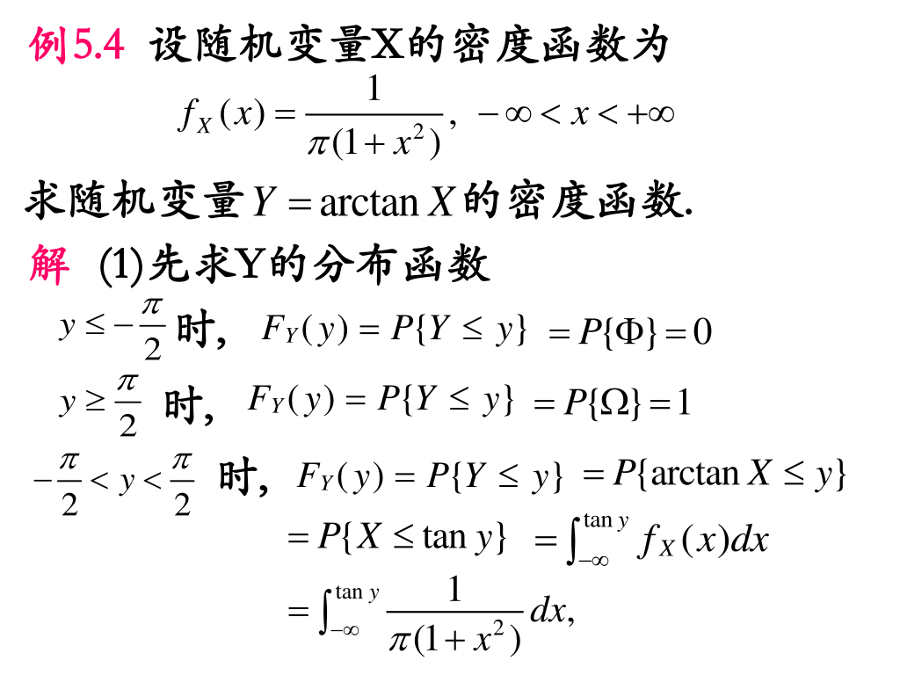
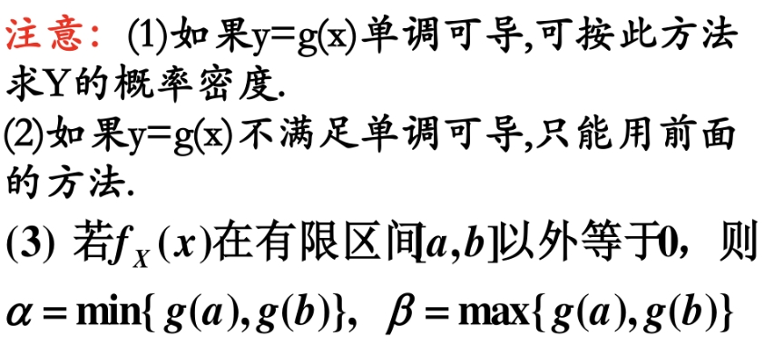
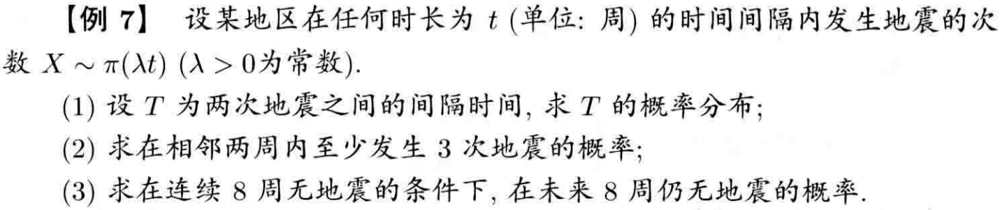
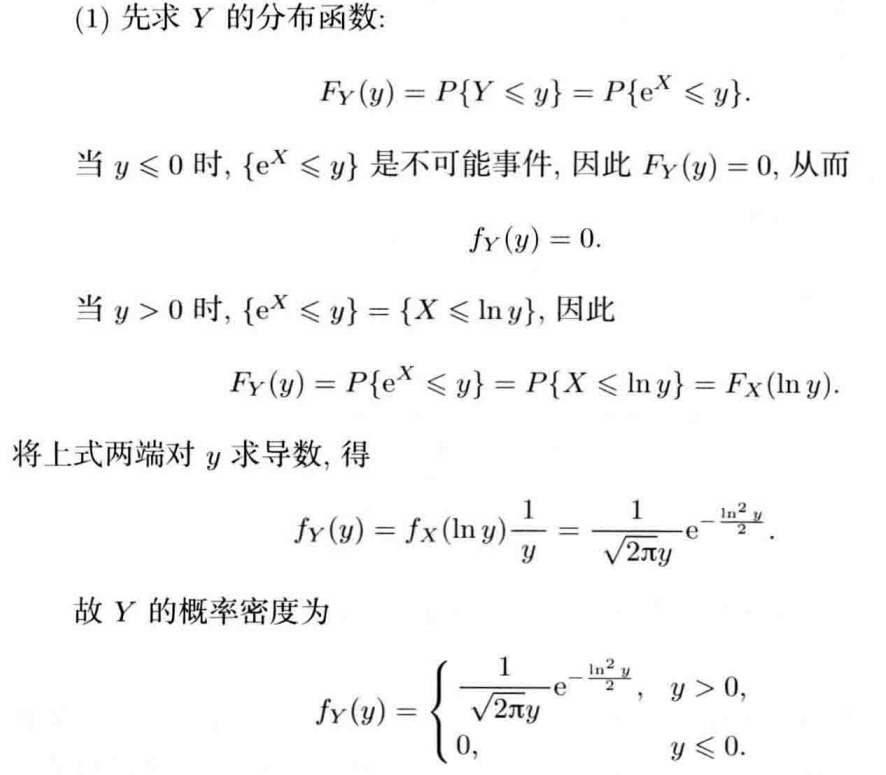
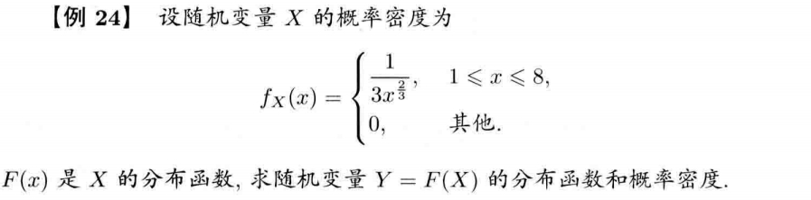

# 第二章 随机变量及其概率分布

## 0 总结

  

## 1 随机变量及其分布函数

- 对于随机试验的样本空间 $\Omega$，若其中每一个样本点 $\omega \in \Omega$，都有一个实数 $x$ 与其相对于，则称 $X = X(\omega)$ 为随机变量。

- 设 $X$ 是一随机变量， $x$ 是任意实数，称 $F(x) = P\{X \le x\},(-\infty < x < \infty)$ 为随机变量 $X$ 的函数

    > $F(x)$ 函数值分布在 $0 \sim 1$ 之间，是单调不减的，且具有右连续性，$F(x^+) = F(x)$。
    >
    > $F(-\infty) = 0$，$F(\infty) = 1$
    >
    > $P\{a < X \le b\} = F(b) - F(a)$

## 2 离散型随机变量及其概率分布

- 若随机变量 $X$ 可取到的不同值是有限个或**可列无限多个项**，并且以确定的概率取这些值，则称 $X$ 为**离散型随机变量**。

    

    

    

## 3 连续型随机变量及其概率密度

- 与离散相对应的便是连续型。$f(x)$ 是概率密度函数，简称概率密度，满足 $F(x) = P\{X \le x\} = \int_{-\infty}^{x}f(t)dt$。

    > 值得注意的是，连续型的分布函数 $F(x)$ 在 $(-\infty, +\infty)$ 但概率密度 $f(x)$ 不一定连续，**也不唯一**。（注意，这里不唯一可以体现在，改变有限个 $f(x)$ 点的取值，并不影响 $F(x)$）

- 概率密度 $f(x)$ 性质

    - $f(x) \ge 0$ 
    -  $\int_{-\infty}^{+\infty}f(x)dx = 1$。
    - $P\{a < X \le b\} = F(b) - F(a) =\int_{a}^{b}f(x)dx$。
    - 在 $f(x)$ 的连续点处满足 $f(x) = F'(x)$。
    - $P\{X = c\} = 0$。**这说明概率为 $0$ 不一定是不可能事件，概率为 $1$ 不一定是必然事件。**
    - $P\{a < X < b\} = P\{a \le X < b\} = P\{a < X \le b\} = P\{a \le X \le b\} $。

## 4 几种常用的分布

**几种常用的离散型随机变量**

- （0 - 1）分布（两点分布）

    若随机变量 $X$ 的分布律为 $P\{X = 1\} = p$，$P\{X = 0\} = 1 - p$ （$0 < p < 1$），则满足（0 - 1）分布。

- 二项分布

    每次实验只有 $A$ 和 $\bar A$ 结果，独立实验 $n$ 次，用 $X$ 表示 $n$ 次实验中 $A$ 发生的次数，$P\{x = k\} = C_{n}^{k}p^k(1 - p)^{n - k}$，则称 $X$ 服从参数为 $np$ 的二项分布，记作 $X \sim B(n, p)$。

    !!! note "二项分布形状特点"

        - 二项分布的形状取决于 $p$ 和 $n$ 的大小。
        - 当 $p$ 接近 $0.5$ 时，图形是对称的。
        - $p$ 离 $0.5$ 越远，对称性越差，但随着 $n$ 的增大，分布趋于对称。

    若 $(n + 1) \cdot p$ 是整数 $m$，则 $P\{X = m\} = P\{X = m - 1\}$ 且在这两处可以取到最大值。

    若 $(n + 1) \cdot p$ 不是整数，则令 $m = \left \lfloor  (n + 1) \cdot p\right \rfloor $，在 $P\{X = m\}$ 处可以取到最大值。

- 泊松（Poisson）分布

    设 $X$ 的所有可能取值为 $0, 1, 2, \dots$，并且 $P\{X = k\} = \dfrac{\lambda^ke^{-\lambda}}{k!}(k = 0, 1, 2, \dots)$，其中 $\lambda > 0$，则称 $x$ 服从泊松分布，记作 $X \sim P(\lambda)$ 或 $X \sim \pi(\lambda)$。

    **泊松定理：**若满足 $np_n = \lambda$，则对任一固定的非负整数 $k$，有 $\lim_{n \to \infty}C_{n}^{k}p_n^k(1 - p_n)^{n - k} = \dfrac{\lambda^ke^{-\lambda}}{k!}(k = 0, 1, 2, \dots)$。（说明了二项分布与泊松分布的关系）

    > **泊松定理说明，泊松分布是二项分布的极限分布，当 $n$ 很大而 $p$ 很小时，二项分布可近似看作参数 $\lambda = np$ 的泊松分布。**

    ??? success "Proof"

        

- 几何分布

    若某事件只有 $A$ 和 $\bar A$ 两种可能，且 $P(A) = p,P(\bar A) = 1 - p$，将事件独立重复发生直到出现结果 $A$ 为止，$X$ 表示所需试验的次数，则 $P\{X = k\} = (1 - p)^{k - 1}p$，称随机变量 $X$ 服从几何分布，记作 $X \sim G(p)$。

- 超几何分布

    随机变量 $X$ 的分布律满足 $P\{X = m\} = \dfrac{C_M^mC_{N - M}^{n - m}}{C_N^n}$，则称 $X$ 服从超几何分布。（可以理解为拿走不放回时的概率）

    > **超几何分布的极限分布是二项分布，二项分布的极限分布是 Poisson 分布。**

**几种常用的连续型随机变量**

- 均匀分布

    若连续型随机变量 $X$ 的概率密度函数为 $f(x) = \begin{cases} \dfrac{1}{b - a} \ a < x < b\\ 0\ \ \ \ \ \ \ \ \ 其他\end{cases}$，则称 $X$ 在区间 $(a, b)$ 上服从均匀分布。

- 指数分布

    若连续型随机变量 $X$ 的概率密度函数为 $f(x) = \begin{cases} \lambda e^{-\lambda x} \ x > 0\\ 0\ \ \ \ \ \ \ \ \ x \le 0\end{cases}$，其中 $\lambda > 0$ 是常数，则称 $X$ 服从参数为 $\lambda$ 的指数分布，记为 $X \sim E(\lambda)$。

- 正态分布

    若连续型随机变量 $X$ 的概率密度函数为 $f(x) = \dfrac{1}{\sigma\sqrt{2\pi}}e^{-\dfrac{(x - \mu)^2}{2\sigma^2}}$，其中 $-\infty < \mu < +\infty, \sigma > 0$，则称 $X$ 服从参数为 $\mu,\sigma$ 的正态分布，记作 $X \sim N(\mu, \sigma^2)$。

    

    正态分布以 $\mu$ 为中心，两边对称相等。其中 $\mu$ 是位置参数，$\mu$ 变大，图形右移，$\mu$ 变小，图形左移（$x = \mu$ 是对称中心）。$\sigma$ 是形状参数，$\sigma$ 变大，图形变平坦，$\sigma$ 变小，图形变陡峭。

- 标准正态分布

    若 $X \sim N(\mu, \sigma^2)$ 且 $\mu = 0, \sigma = 1$，则称 $x$ 服从标准正态分布，记为 $X \sim N(0, 1)$。此时概率密度 $\varphi(x) = \dfrac{1}{\sqrt{2 \pi}}e^{-\dfrac{x^2}{2}}$，分布函数 $\Phi(x) = \int_{-\infty}^x \varphi(x)dx$，且有 $\Phi(x) + \Phi(-x) = 1$。

    若 $X \sim N(\mu, \sigma^2)$，则 $Y = \dfrac{X - \mu}{\sigma} \sim N(0, 1)$（正态分布与标准正态分布的关系）。这个关系可以将正态分布的概率计算化为标准正态分布来计算。

    

    

    

    

## 5 随机变量的函数的分布

- 常规情况下直接按题意做即可，用一道例题简单说明。

    

    

- 特殊情况

    

    ??? success "Proof"

        

        

    

    用一道例题具体说明一下该方法的使用

    

    我们根据这种方法可以得出一个有关正态分布的结论：

    

- 随机变量的函数分布的两种方法
    - 一般方法：先求分布函数，再求密度函数的方法。
    - 特殊情况：如果 $Y = g(x)$ 单调可导，利用反函数代入的方法。

## 6 习题课

- e.g.1

    

    ??? success "Solution"

        

        !!! note

            这题有点类似于第八章假设检验中的右侧检验，假设随机猜的为真，按随即猜测的概率算出的样本事件是小概率事件，故不是猜测的。这里相当于计算落入右边区间的概率。
  
- e.g.2

    

    ??? success "Solution"

        

        !!! note

            本题有一点绕，分布函数中涉及到了两个变量，一定要弄明白这两个变量在随机函数中的意义和作用。**需要注意的是，在第一小问中，令 $k = 0$，算出来的是 $P\{T > t\}$ 的概率而不是 $P\{T < t\}$ 的概率。**

- e.g.3

    

    ??? success "Solution"

        

        

- e.g.4 **又是条件概率的问题，和 chap 1 e.g.10 很像，但是还是做错了 🥲**

    

    ??? success "Solution"

        

        

- e.g.5 

    

    ??? success "Solution"

        

- e.g.6 

    

    ??? success "Solution"

        

        

- e.g.7 **注意这里 $Y$ 表示的是 $F(X)$ 的数值，这里 $Y$ 取值范围是 $0$ 到 $1$，相当于求的是 $F(X)$ 所对应的数值服从的分布。**

    

    ??? success "Solution"

        

