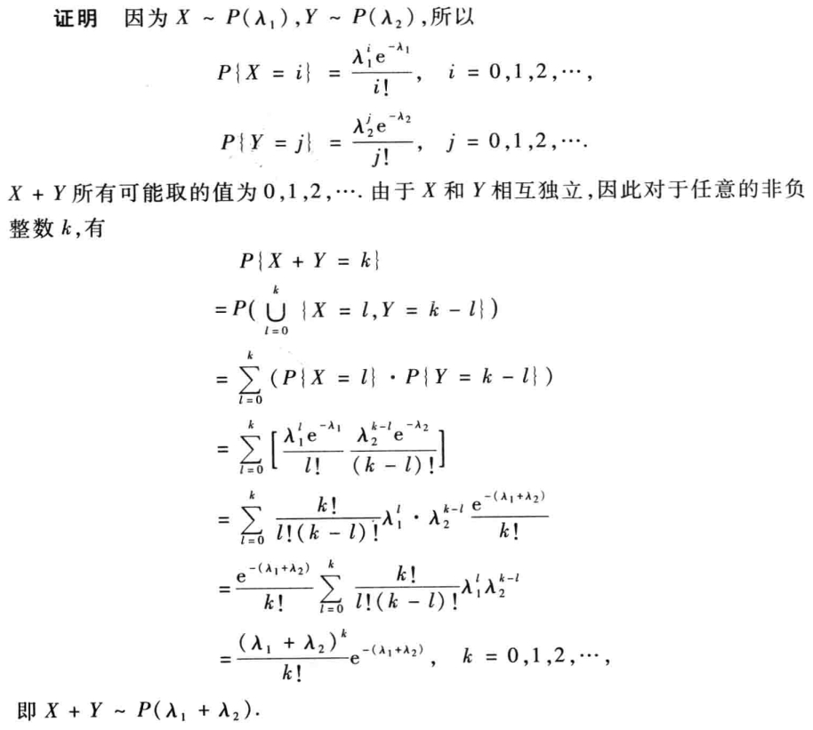
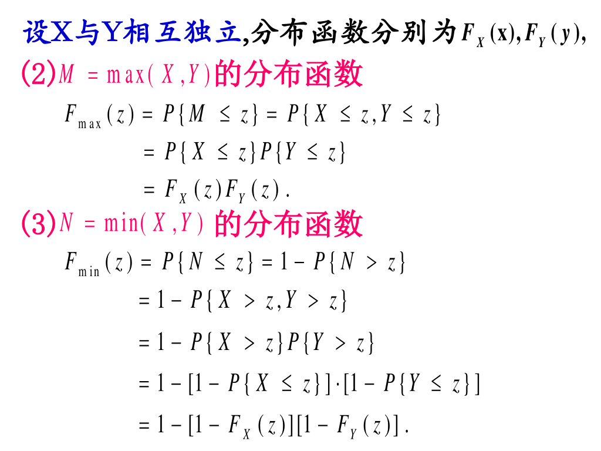
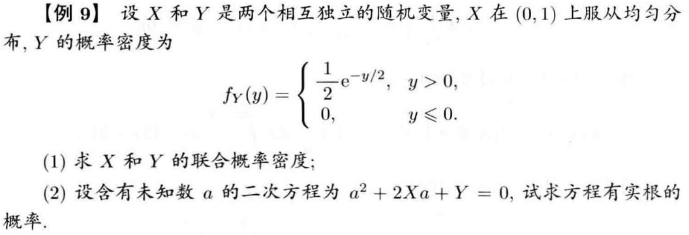

# 第三章 多维随机变量及其概率分布

## 1 二维随机变量

### 1.1 二维随机变量及其分布函数
- 设随机试验 $E$ 的样本空间为 $\Omega$，$X$ 和 $Y$ 是定义在 $\Omega$ 上的两个随机变量，由它们构成的向量 $(X, Y)$ 称为二维随机变量。
> 二维随机变量可以看作是平面上的点，其性质不仅分别与 $X$，$Y$ 有关，还与这两个随机变量之间关系有关。
- 二元函数 $F(x, y)$ 称为二维随机变量 $(X, Y)$ 的分布函数或 $X$ 与 $Y$ 的联合分布函数。
> $F(x_0, y_0)$ 的几何意义就是平面上落在 $(x_0, y_0)$ 左下角的概率。

$$
F(X, Y) = P \left \{ \left \{ X \le x \right \}\cap \left \{ Y \le y \right \} \right \} = P \left \{X \le x, Y \le y \right \}
$$

!!! Note "$F(X, Y)$ 的性质" 
    - $F(x, y) \in [0, 1]$ 且 $F(-\infty, -\infty) = F(x, -\infty) = F(-\infty, y) = 0$，$F(+\infty, +\infty) = 1$。
    - 当其中一个变量 x 或 y 固定时，$F(x, y)$ 可以看作是关于另一个变量的一元函数，且均满足一元分布函数性质。
    - $P\{x_1 \le X \le x_2, y_1\le Y \le y_2 \} = F(x_2, y_2) - F(x_1, y_2) - F(x_2, y_1) + F(x_1, y_1)$（从几何性质上很容易看出）

### 1.2 边缘函数
- 关于 $X$ 的边缘分布函数 $F_x(x) = \lim_{y \to +\infty} F(x, y)$。关于 $Y$ 的边缘分布函数 $F_y(Y) = \lim_{x \to +\infty} F(x, y)$。
- 若 $F(x, y) = F_X(x) \cdot F_Y(y)$，则说明 $X$ 与 $Y$ 相互独立。（类比 $P(AB) = P(A)P(B)$）
- **若 $X, Y$ 不相互独立，联合函数 $F(x, y)$ 可以确定两个边缘函数，但是两个边缘函数不能确定一个联合函数。若 $X, Y$ 相互独立，联合分布函数能确定边缘分布函数，边缘函数也能确定联合函数。**

### 1.3 随机变量的独立性
- 对于 $(X, Y)$ 的分布函数 $F(x, y)$ 以及 $X$ 和 $Y$ 的边缘分布函数 $F_X(x)$，$F_Y(y)$，若满足 $F(x, y) = F_X(x) F_Y(y)$，则称 $X$ 和 $Y$ 相互独立。
  -  $X$ 与 $Y$ 相互独立是指两事件 $\{X \le x\}$ 和 $\{Y \le y\}$ 相互独立。
  - 若 $X$ 与 $Y$ 相互独立，则联合分布函数 $\stackrel{确定}{\longleftrightarrow }$ 边缘分布函数。若 $X$ 与 $Y$ 不相互独立，则联合分布函数 $\stackrel{确定}{\longrightarrow}$ 边缘分布函数。
  - 若 $X$ 与 $Y$ 相互独立，则对任意连续函数 $h$，$g$，$h(X)$ 和 $g(Y)$ 也相互独立。

## 2 二维离散型随机变量
### 2.1 二维离散型随机变量及其概率分布
- 若二维随机变量 $(X, Y)$ 所有可能取的值是有限对或可列无穷多对，则称 $(X, Y)$ 为二维离散型随机变量。
- $F(X = x_i, Y = y_j) = p_{ij}$ 称为 $(X, Y)$ 的概率分布（分布律）或 $X$ 和 $Y$ 联合分布概率（联合分布律）。

### 2.2 二维离散型随机变量边缘分布
- 二维随机变量 $(X, Y)$ 中，$X$ 的分布律称为 $(X, Y)$ 关于 $X$ 的边缘分布率，$Y$ 的分布律称为 $(X, Y)$ 关于 $Y$ 的边缘分布率。

\begin{cases}
P\{X = x_i\} = p_{i.} = \sum_{j = 1}^{\infty}p_{ij} \\
P\{Y = y_j\} = p_{.j} = \sum_{i = 1}^{\infty}p_{ij}
\end{cases}

!!! tip
    - 联合分布律可确定边缘分布律，反之不一定。
    - 边缘分布律都是一维随机变量的分布律。

### 2.3 二维离散型随机变量的独立性
- $X$ 和 $Y$ 相互独立的充要条件是 $p_{ij} = p_{i.} \cdot p_{.j}$。
- 推论：对于离散型 $(X, Y)$，若 $X$ 和 $Y$ 相互独立，那么 $(X, Y)$ 联合分布的概率行与行之间成比例，列于列之间成比例。若 $p_{ij}$ 中有一个为 $0$，那么 $X$ 和 $Y$ 一定不相互独立。

## 3 二维连续型随机变量
### 3.1 二维连续型随机变量及其概率密度
- 设二维随机变量 $(X, Y)$ 的分布函数为 $F(x, y)$，如果存在非负函数 $f(x, y)$，使对任意 $X, Y$ 均有 $F(x, y) = \int_{-\infty}^{x}\int_{-\infty}^{y}f(u, v)dvdu$，则称 $(X, Y)$ 为二维连续型随机变量，$f(x, y)$ 称为 $(X, Y)$ 的概率密度，也称为 $X$ 和 $Y$ 的联合概率密度。
- 对于二维连续型随机变量有 F(x,y)连续, f(x,y)不一定连续，且平面 xoy 上点和线对应的概率均为 $0$。

!!! note "概率密度 $f(x, y)$ 的性质"
    

    

### 3.2 二维连续型随机变量边缘分布
- 关于 $X$ 的边缘概率密度为 $f_X(x) = \int_{-\infty}^{+\infty}f(x, y)dy (-\infty <  x < +\infty)$

    关于 $Y$ 的边缘概率密度为 $f_Y(y) = \int_{-\infty}^{+\infty}f(x, y)dx (-\infty <  y < +\infty)$

### 3.3 二维连续型随机变量的独立性

- 若 $f(x, y) = f_X(x)f_Y(y)$，则 $X$ 和 $Y$ 事件相互独立，且这两者互为充要关系。

    !!! tip

        如果判断出 $X$ 和 $Y$ 相互独立，直接用恒等式证明即可。如果判断出不相互独立，还需要代入特值说明一下。

### 3.4 二维均匀分布和正态分布
- 二维均匀分布 
  
    二维随机变量落在某一区域概率完全相等称为二维均匀分布。

- 二维正态分布  
  
    设二维随机变量 $(X，Y)$ 的概率密度为 

    $$
    f(x, y) = \dfrac{1}{2 \pi \sigma_1 \sigma_2 \sqrt{1 - \rho^2}}e^{\left \{\dfrac{-1}{2(1 - \rho^2)}\left [\dfrac{(x - \mu_1)^2}{\sigma_1^2} - 2\rho \dfrac{(x - \mu_1)(y - \mu_2)}{\sigma_1 \sigma_2} + \dfrac{(y - \mu_2)^2}{\sigma_2^2}\right ]\right \}}
    $$

    则称 $(X, Y)$ 服从参数为 $\mu_1$，$\mu_2$，$\sigma_1$，$\sigma_2$，$\rho$ 的二维正态分布，记为 $(X, Y) \sim N(\mu_1, \mu_2, \sigma_1^2, \sigma_2^2, \rho)$，且各个参数满足 $-\infty < \mu_1, \mu_2 < +\infty, \sigma_1, \sigma_2 > 0, |\rho| < 1$。

    !!! 二维正态分布的性质
        

## 4 条件分布

### 4.1 离散型随机变量的条件分布

- $P\{X = x_i | Y = y_j\} = \dfrac{P\{X = x_i, Y = y_j\}}{P\{Y = y_j\}}$

### 4.2 连续性随机变量的条件分布
    
- $F_{X|Y}(x|y) = P(X \le x| Y = y)$ 表示条件 $Y = y$ 下 $X$ 的条件分布。 

- $f_{X|Y}(x|y) = \dfrac{f(x, y)}{f_Y(y)}$ 表示条件 $Y = y$ 下 $X$ 的条件概率密度。 

- 条件分布和条件概率密度满足 $F_{X|Y}(x|y) = \int_{-\infty}^{x}\dfrac{f(u, y)}{f_Y(y)}du$

    !!!tip
        

        

        

## 5 二维随机变量的函数的分布

> 本节要多做点题。会用公式法，图形定限法，卷积法。

### 5.1 离散型

$Z = g(x, y)$，通过列表格法，确定不同 $x, y$ 数值所对应 $z$ 的值，然后再求出每个 $P\{Z = z_k\}$ 概率。

??? success "证明 $X + Y \sim P(\lambda_1 + \lambda_2)$"

    

### 5.2 连续型
    
!!! note
    已知 $(X,Y)$ 概率密度，求 $Z = g(X, Y)$ 概率密度
        
    - 先求随机变量 $Z$ 的分布函数 $F_Z(z) = \int_{g(x, y) \le z}f(x, y)dxdy$
    - 对 $F_Z(z)$ 求导，得 $Z$ 的概率密度函数 $f_Z(z) = F_Z'(z)$

!!! note
    图形限定法相当于先把 y 消去，只求 z 和 x 的关系。然后作出 xoz 中符合条件的区域。
    
    做一条平行 x 轴的线，然后沿着这条线对 x 积分，形式是 $f_Z(z) = \int_{-\infty}^{+\infty} f(x, z - x)dx$

### 5.3 三种特殊的连续型情况

- $Z = X + Y$

    

    
    !!! tip
        这里说明若两个随机变量独立，联合概率密度可以拆分成两个边缘概率密度的乘积再积分形式。

- 独立正态随机变量的重要结论
  
    

- $\max(x, y)$ 和 $\min(x, y)$ 的分布函数
 
    

    

    

    

    

## 6 n维随机变量

> 这节真没我什么事qwq。

## 7 例题

- e.g.1
  
    

- e.g.2

    

- e.g.3  

    

- e.g.4

    

    ??? success "Solution"

        

- e.g.5

    

    ??? success "Solution"

        

        

        !!! note

            这题最后化成积分的时候要想起来利用正态分布公式来做！

- e.g.6

    

    

    ??? success "Solution"

        

        

