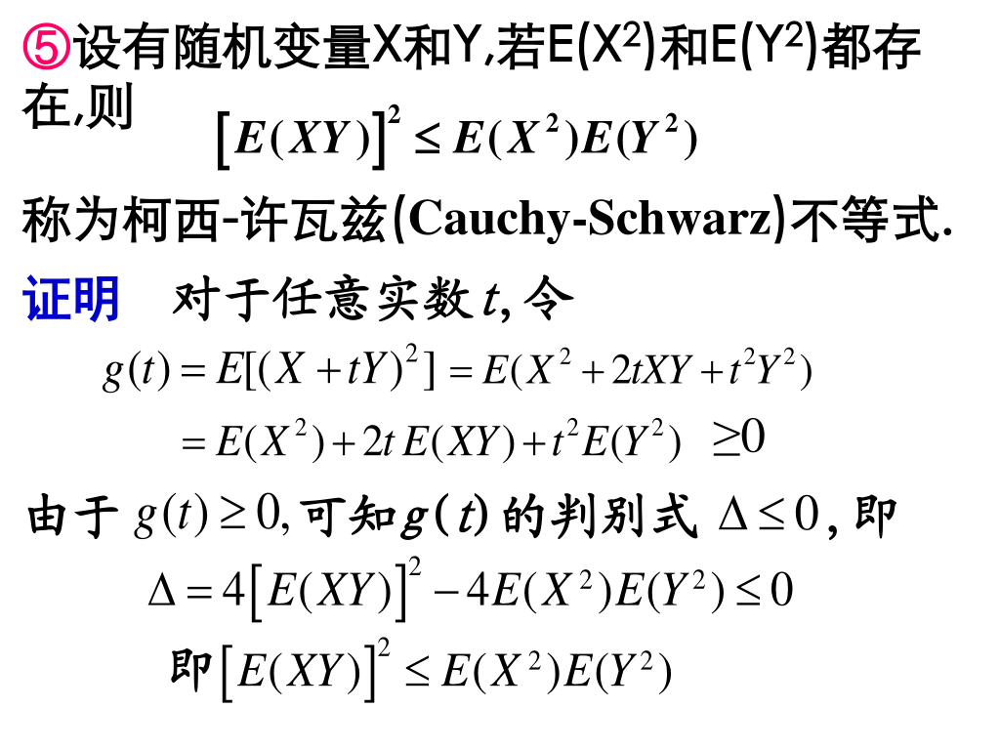
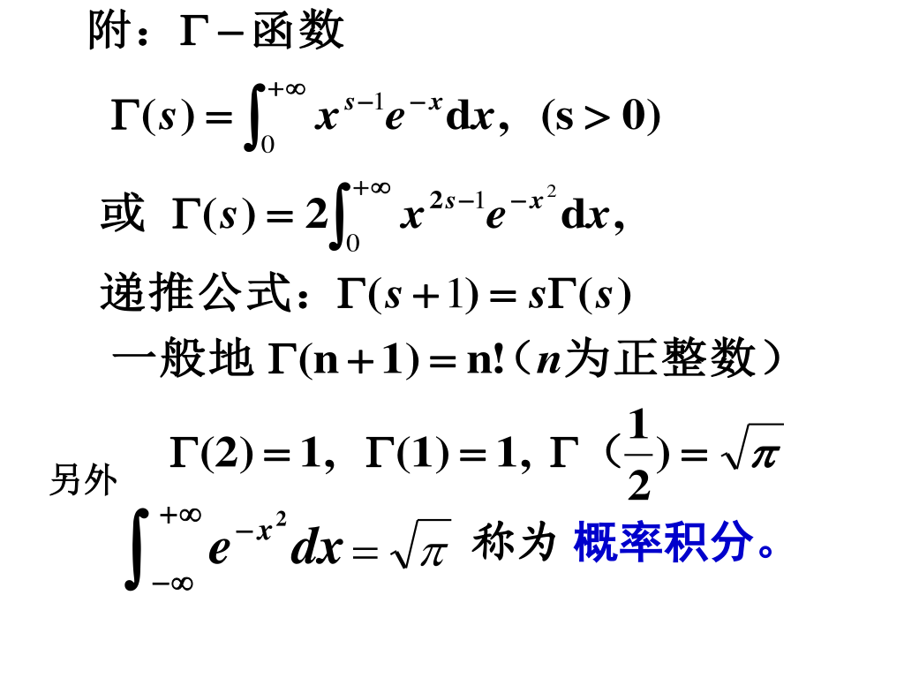
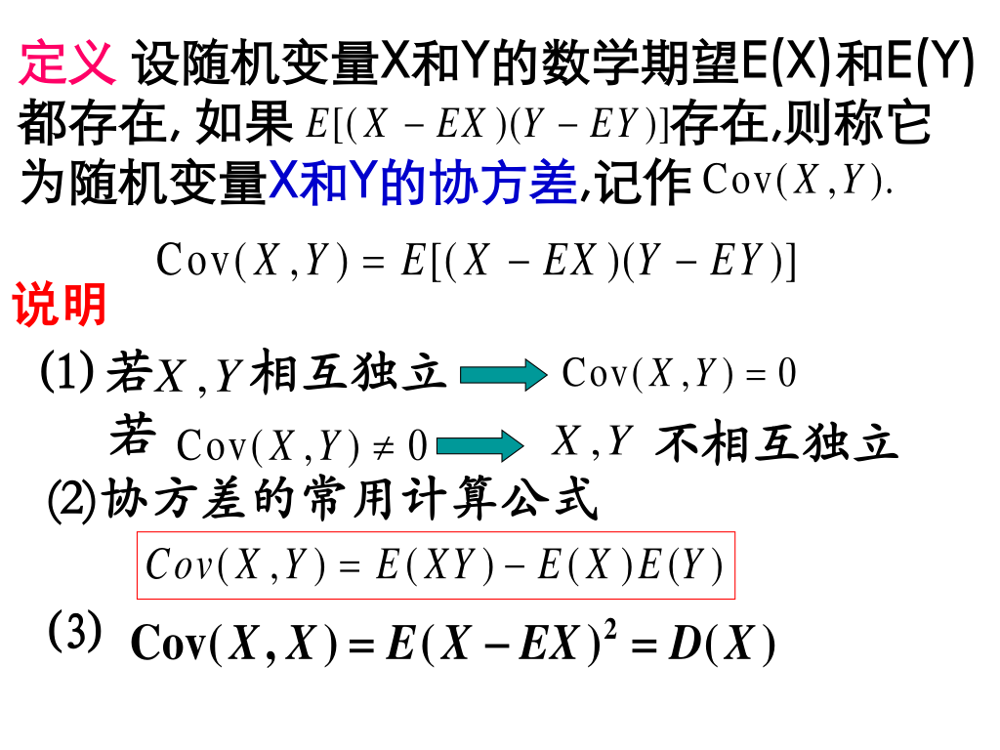
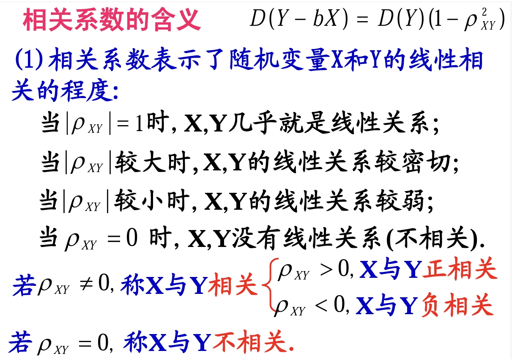
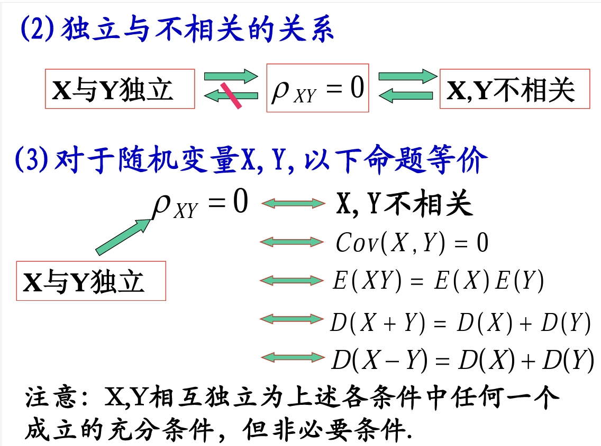
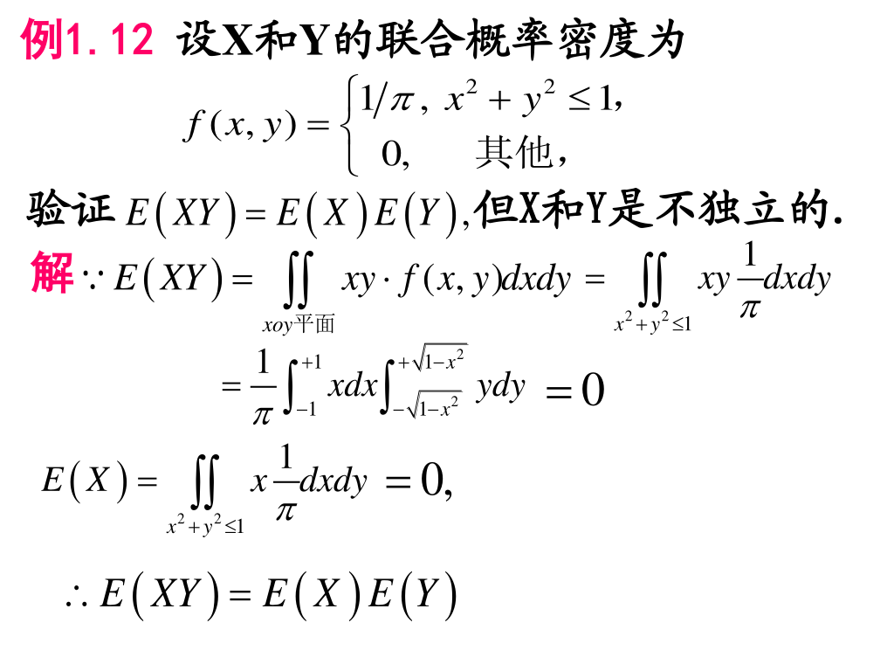
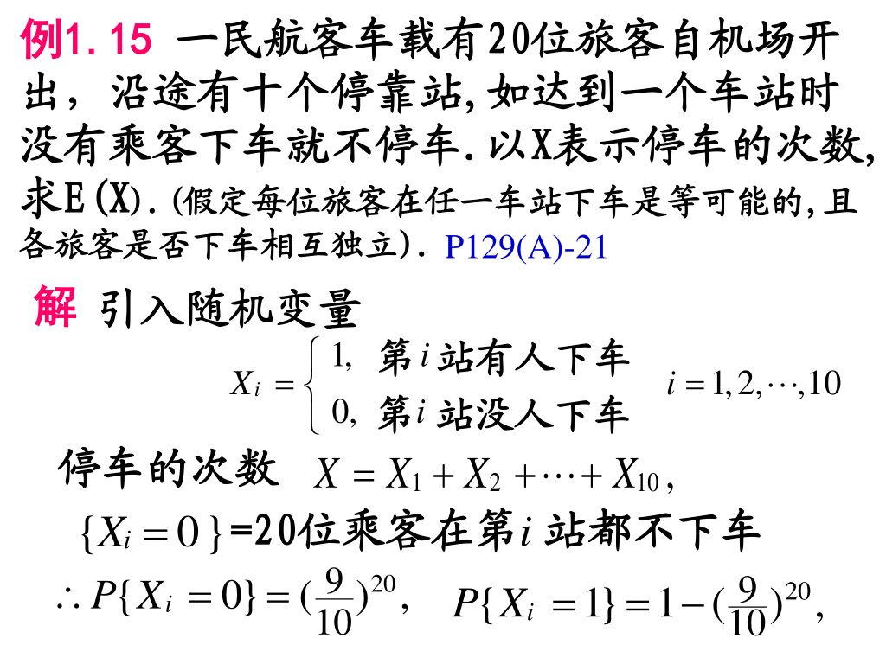
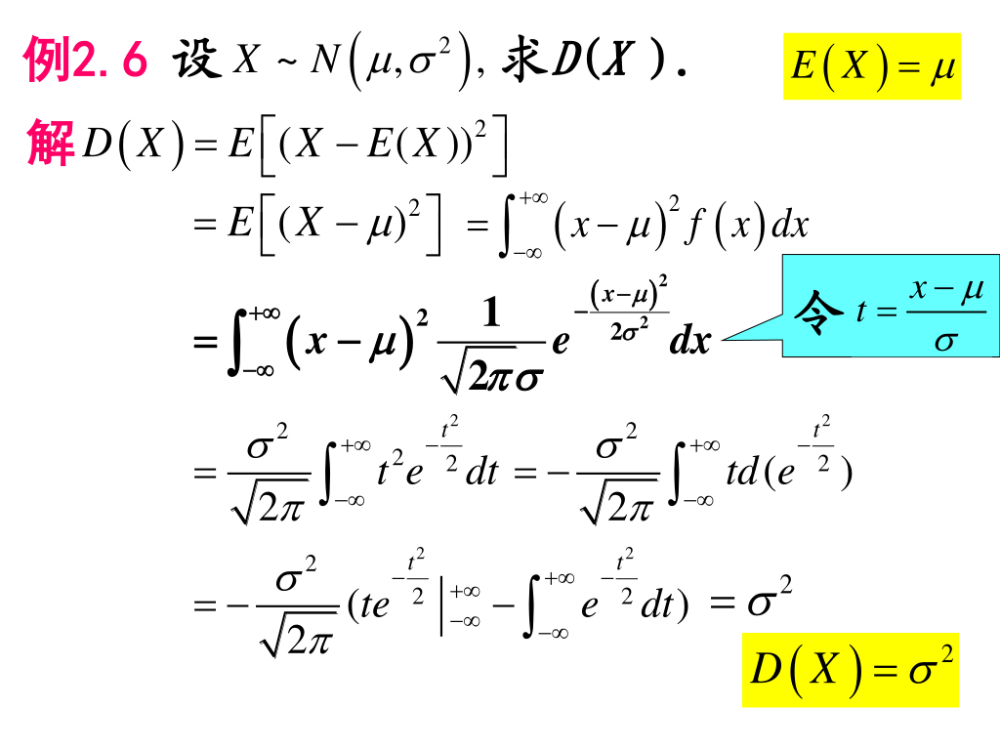

# 随机变量数字特征

## 1 数学期望

### 1.1 基本概念

- 离散型随机变量的期望
  
    $$
      E(X) = \sum_{k = 1}^{\infty}x_kp_k
    $$

- 连续型随机变量的期望

    $$
      E(X) = \int_{-\infty}^{+\infty}xf(x)dx
    $$

    !!! tip 

        注意，如果期望存在，$E(X)$ 要满足绝对收敛。

- 常见随机分布的期望

    $X$ 服从 $(0, 1)$ 分布，$E(X) = p$。

    $X \sim B(n, p)$ ，$E(X) = np$。

    ??? success "证明"

    $X \sim P(\lambda)$ ，$E(X) = \lambda$。

    ??? success "证明"

    $X$ 服从参数为 $p$ 的几何分布，$E(X) = \dfrac{1}{p}$。

    ??? success "证明"
    
    $X$ 服从 $(a, b)$ 上的均匀分布，$E(X) = \dfrac{a + b}{2}$。

    ??? success "证明"

    $X \sim N(\mu, \sigma^2)$ ，$E(X) = \mu$。

    ??? success "证明"

    $X$ 服从参数为 $\lambda$ 的指数分布，$E(X) = \dfrac{1}{\lambda}$。
  
    ??? success "证明"

### 1.2 随机变量的函数的随机期望
- 离散型函数的期望
  
    $$
      E(Y) = E[g(X)] = \sum_{k = 1}^{\infty}g(x_k)p_k
    $$

- 连续型函数的期望

    $$
      E(Y) = E[g(X)] = \int_{-\infty}^{+\infty}g(x)f(x)dx
    $$

- 二元离散型函数的期望
  
    $$
      E(Z) = E[g(X, Y)] = \sum_{j = 1}^{\infty}\sum_{i = 1}^{\infty}g(x_i, y_j)p_{ij}
    $$

- 二元连续型函数的期望

    $$
      E(Z) = E[g(X, Y)] = \int_{-\infty}^{+\infty}\int_{-\infty}^{+\infty}g(x, y)f(x, y)dxdy
    $$

### 1.3 数学期望性质

- $E(aX + bY + c) = aE(X) + bE(Y) + c$（$a, b, c$ 均为常数）

- 设 $X$，$Y$ 相互独立，则有 $E(XY) = E(X)X(Y)$。（但是反过来不一定成立，见后面例题） 

- 设有随机变量 $X$ 和 $Y$，若 $E(X^2)$ 和 $E(Y^2)$ 都存在，则 $[E(XY)]^2 \le E(X^2)E(Y^2)$ 称为 Cauchy-Schwarz 不等式。
        
    ??? success "证明"
        
    
- 额外补充

    

## 2 方差

### 2.1 基本概念
- 若随机变量的 $E(X - E(X))^2$ 存在，则称它为 $X$ 的方差，记作 $D(X)$，记 $\sigma(X) = \sqrt{D(X)}$ 为随机变量 $X$ 的均方差（标准差）。
    
    !!! tip
        
        
        > **这个公式非常重要，算 $E(x^2)$ 或 $E^2(x)$ 时，要么利用定义，要么用这个公式来转化。同理如果 $D(x)$ 不好算而 $E(x^2)$ 和 $E^2(x)$ 好算，也可以利用这个公式。**

- 常见随机分布的方差
    
    $X$ 服从 $(0, 1)$ 分布，$D(X) = p(1 - p)$。

    $X \sim B(n, p)$ ，$D(X) = np(1 - p)$。

    ??? success "证明（两解）"

    $X \sim P(\lambda)$ ，$D(X) = \lambda$。

    ??? success "证明"

    $X$ 服从参数为 $p$ 的几何分布，$D(X) = \dfrac{1 - p}{p^2}$。

    ??? success "证明"
    
    $X$ 服从 $(a, b)$ 上的均匀分布，$D(X) = \dfrac{(b - a)^2}{12}$。

    ??? success "证明"

    $X \sim N(\mu, \sigma^2)$ ，$D(X) = \sigma^2$。

    ??? success "证明"

    $X$ 服从参数为 $\lambda$ 的指数分布，$D(X) = \dfrac{1}{\lambda^2}$。
  
    ??? success "证明"

    **重要附录表**

    

### 2.2 方差的性质
- 如果 $X$ 和 $Y$ 相互独立：$D(aX + bY + c) = a^2D(X) + b^2D(Y)$。

- 如果 $X$ 和 $Y$ 不相互独立：$D(X \pm Y) = D(X) + D(Y) \pm 2E[(X - EX)(Y - EY)]$。 

- 如果 $D(X) = 1$，说明 $P\{X = E(X)\} = 1$。

!!! tip
    
    > 注意，这里方差为 $0$ 可以表示 $E(X)$ 为常数的概率为 $1$，但是期望为常数的概率是 $1$ 也不能说明期望一定是常数，在 `注2` 里举了反例。所以不能说 $X$ 取值相等，只能说**几乎处处**相等。
  
  

### 2.3 随机变量的标准化

- 设 $X$ 的数学期望 $E(X) = \mu$，方差 $D(X) = \sigma^2 > 0$，则称 $X^* = \dfrac{X - \mu}{\sigma} = \dfrac{X - E(X)}{\sqrt{D(X)}}$ 为 $X$ 的标准化随机变量。
  
    标准化随机变量的数学期望是 $0$，方差是 $1$，即 $E(X^*) = 0, D(X^*) = 1$。

## 3 协方差与相关系数 

### 3.1 协方差
- 设随机变量 $X$ 和 $Y$ 的数学期望 $E(X)$ 和 $E(Y)$ 都存在, 如果 $E[(X - EX)(Y - EY)]$ 存在，则称它为随机变量 $X$ 和 $Y$ 的协方差,记作 $\mathrm{Cov}(X, Y)$。则有

$$
  \mathrm{Cov}(X, Y) = E[(X - E(X))(Y - E(Y))]
$$

!!! tip
    

- 协方差的性质
    - $\mathrm{Cov}(X, Y) = \mathrm{Cov}(Y, X)$
    - $\mathrm{Cov}(aX, bY) = ab\mathrm{Cov}(X, Y)$
    - $\mathrm{Cov}(X_1 + X_2, Y) = \mathrm{Cov}(X_1, Y) + \mathrm{Cov}(X_2, Y)$
    - $D(X \pm Y) = D(X) + D(Y) + \pm 2\mathrm{Cov}(X, Y)$
    - $D(aX \pm bY) = a^2D(X) + b^2D(Y) \pm 2ab\mathrm{Cov}(X, Y)$

### 3.2 相关系数
- 如果 $\mathrm{Cov(X, Y)}$ 存在且 $D(X) \ne 0, D(Y) \ne 0$，那么称 $\rho_{XY} = \dfrac{\mathrm{Cov}(X, Y)}{\sqrt{D(X)}\sqrt{D(Y)}}$ 为 $X$，$Y$ 的相关系数。
  
    当 $\rho = 0$ 时，称 $X, Y$ 是不相关。

    !!! tip
        - 相关系数常用公式 $\rho_{XY} = \dfrac{E(X, Y) - E(X)E(Y)}{\sqrt{D(X)}\sqrt{D(Y)}}$
        - $\rho_{XY} = \mathrm{Cov}(X^*, Y^*)$
        - 若 $X, Y$ 不相关，但 $X, Y$ 不一定独立。

    !!! note "相关系数的性质"
        - $|\rho_{XY}| \le 1$
        - 若 $X$ 和 $Y$ 相互独立，则 $\rho_{XY} = 0$。
        - 若 $|\rho_{XY}| = 1$ $\Leftrightarrow$ 存在常数 $a, b$ 使 $P\{Y = a + bX\} = 1$。
  
    !!! note "二维正态分布的结论"
        - 若 $(X, Y) \sim N(\mu_1, \mu_2, \sigma_1^2, \sigma_2^2, \rho)$，证明 $X$ 与 $Y$ 的相关系数 $\rho_{XY} = \rho$。
        - 若 $(X, Y) \sim N(\mu_1, \mu_2, \sigma_1^2, \sigma_2^2, \rho)$，在此情况下，$X$ 与 $Y$ 相互独立与 $X$ 与 $Y$ 不相关互为充要条件。
        - 若 $(X, Y) \sim N(\mu_1, \mu_2, \sigma_1^2, \sigma_2^2, \rho)$，则 $\mathrm{Cov}(X, Y) = \rho \sigma_1 \sigma_2$。

    !!! note "相关系数的含义"
        
        

## 4 矩

### 4.1 原点矩和中心矩
- 对于随机变量 $X,Y$，
    - 称 $E(X^k)$ 为 $k$ 阶原点矩($k$ 阶矩)。
    - 称 $E[(X - E(X))^k]$ 为 $k$ 阶中心矩。  
    - 称 $E(X^kY^l)$ 为 $k + l$ 阶混合矩。
    - 称 $E[(X - E(X)^k(Y - E(Y))^l)]$ 为 $k + l$ 阶混合中心矩。
    - 特殊的，$E(X)$ 为 $1$ 阶原点矩，$D(X)$ 为 $2$ 阶中心矩，$\mathrm{Cov}(X, Y)$ 为 $2$ 阶混合中心矩。
  

### 4.2 协方差矩阵
- 对于二维随机变量 $(X_1, X_2 )$ 记
    - $c_{11} = E[(X_1 - E(X_1))^2] = D(X_1)$
    - $c_{12} = E[(X_1 - E(X_1))(X_2 - E(X_2))] = \mathrm{Cov}(X_1, X_2)$
    - $c_{21} = E[(X_1 - E(X_2))(X_1 - E(X_1))] = \mathrm{Cov}(X_2, X_1)$
    - $c_{22} = E[(X_2 - E(X_2))^2] = D(X_2)$
- 二维随机变量的协方差矩阵

\begin{equation}
C = \begin{bmatrix}
        D(X_1) & \mathrm{Cov}(X_1, X_2) \\
        \mathrm{Cov}(X_2, X_1) & D(X_2)
    \end{bmatrix}
\end{equation}
  
  

### 4.3 $n$ 维正态分布
- 二维正态分布的矩阵表示式
  

- $n$ 维正态分布的矩阵表示式
  

!!! note "$n$ 维正态随机变量的性质"  
    
    

## 5 例题

  

  

  

  

  

  **（这些证明都要求掌握）**

  

  

  

  

  

  

  

  

  

  

