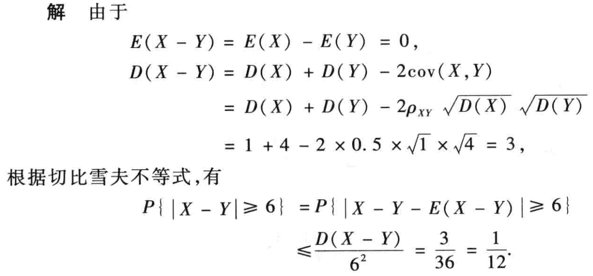
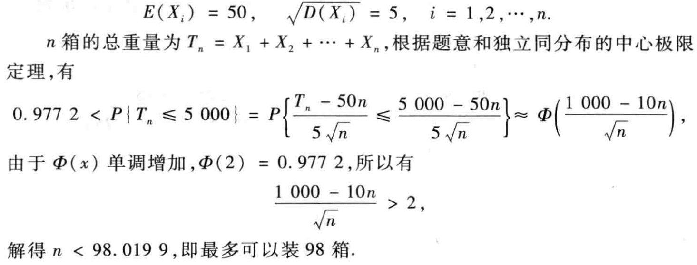

# 大数定律及中心极限定理
## 0 总结

## 1 切比雪夫不等式
- 设 $X$ 的数学期望和方差都存在，则对任意给定的正数 $\varepsilon$，有
    
    \begin{equation}
      P \left \{|X - E(X)| \ge \varepsilon \right \} \le \dfrac{D(X)}{\varepsilon^2}
    \end{equation}

    !!! note
        - 方差 $D(X)$ 越小，事件 $|X - E(X)| < \varepsilon$ 的概率越大。说明 $X$ 的取值越集中在均值 $E(X)$ 附近， 即 $X$ 偏离 $E(X)$ 的程度越小，故方差 $D(X)$ 确实是反映 $X$ 偏离 $E(X)$ 程度的量。
        - 无需知道 $X$ 的分布,只要知道 $D(X)$，就可对 $X$ 落入以 $E(X)$ 为中心的对称区间 $(E(X) - \varepsilon, E(X) + \varepsilon)$ 内（或外）的概率进行粗略估值。 

## 2 大数定律
- 依概率收敛
    
    设 $X_1, X_2, \cdots, X_n, \cdots$ 是一个随机变量序列，$a$ 是一个常数，若对任何正数 $\varepsilon$，有 $\lim_{n \to \infty}P\{|X_n - a| < \varepsilon\} = 1$，则称序列 $X_1, X_2, \cdots, X_n, \cdots$ 依概率收敛于 $a$，记为 $X_n \stackrel{p}{\longrightarrow} a$。

    !!! note
        - 另一种形式 $\lim_{n \to \infty}P\{|X_n - a| \ge \varepsilon\} = 0$
        - 依概率收敛与高数中的收敛意义不同。
        - 设 $X_n \stackrel{p}{\longrightarrow} a, Y_n \stackrel{p}{\longrightarrow} b$ 函数 $g(x, y)$ 在 $(a, b)$ 连续，则 $g(X_n, Y_n) \stackrel{p}{\longrightarrow} g(a, b)$。
        - 这反映了在 $n \to \infty$ 时，随机变量 $X_n$ 的值会收敛于某个定值（**不要和依分布收敛混淆**）。 
  
- 切比雪夫大数定律
    
    设随机变量序列 $X_1, X_2, \cdots, X_n, \cdots$ 相互独立，且均存在数学期望及方差，且方差有界（即存在正数 $M$，使 $D(X_n) \le M, (n = 1, 2, \cdots)$），则对任意给定的 $\varepsilon > 0$，恒有

    \begin{equation}
      \lim_{n \to \infty} P \left \{ \left |\dfrac{1}{n} \sum_{k = 1}^nX_k - \dfrac{1}{n}\sum_{k = 1}^nE(X_k) \right | < \varepsilon \right \} = 1
    \end{equation}

    这说明了 $\bar X \stackrel{p}{\longrightarrow} E(\bar X)$

    !!! note
        若随机序列 $\{X_n\}$，对于每项均有 $E(X_k) = \mu, D(X_k) = \sigma^2$，则

        \begin{equation}
          \lim_{n \to \infty} P \left \{ \left |\dfrac{1}{n} \sum_{k = 1}^nX_k - \mu \right | < \sigma \right \} = 1
        \end{equation}

- 伯努利大数定律
    
    设 $n_A$ 是 $n$ 次独立重复试验中事件 $A$ 发生的次数，$p$ 是事件 $A$ 在一次实验中发生的概率，则对任意 $\varepsilon > 0$ 有

    \begin{equation}
      \lim_{n \to \infty} P \left \{ \left |\dfrac{n_A}{n} - p \right | < \varepsilon \right \} = 1
    \end{equation}

    !!! note
        - 当 $n \to \infty$ 时，事件的频率收敛于概率。
        - 伯努利大数定理表示当试验次数 $n$ 很大时，可用事件发生的频率代替概率。

- 辛钦大数定律（独立同分布大数定律）
    
    设随机变量序列 $X_1, X_2, \cdots, X_n, \cdots$ 相互独立，且服从同一分布，且 $E(X_k) = \mu$，则对任意给定的 $\varepsilon > 0$，恒有

    \begin{equation}
      \lim_{n \to \infty} P \left \{ \left |\dfrac{1}{n}\sum_{k = 1}^n X_k - \mu \right | < \varepsilon \right \} = 1
    \end{equation}

    !!! tip

        伯努利是辛钦的特殊情况。

## 3 中心极限定理
- 依分布收敛
  
    设随机变量 $X_1, X_2, \cdots, X_n, \cdots$ 的分布函数依次是 $F(x), F_1(x), \cdots, F_n(x), \cdots$ 如果对于 $F(X)$ 的每一个连续点 $x$，都有 $\lim_{n \to \infty}F_n(x) = F(x)$，则称随机变量序列 $X_1, X_2, \cdots, X_n, \cdots$ 依分布收敛于 $X$，记作 $X_n \stackrel{L}{\longrightarrow} X$ 特别地,若 $X$ 服从标准正态分布，则 $\lim_{n \to \infty}F_n(x) = \Phi(x)$。

    !!! tip

        这反映了在 $n \to \infty$ 时，随机变量 $X_n$ 的分布形式会收敛于某个特定的分布形式（**不要和依概率收敛混淆**）。 

- 莱维—林德伯格定理（独立同分布的中心极限定理）
  
    设随机变量 $X_1, X_2, \cdots, X_n, \cdots$ 相互独立，服从同一分布,数学期望为 $\mu$ 和方差 $\sigma^2 > 0$，则对于随机变量 
        
    \begin{equation}
      Y_n = \dfrac{\sum_{k = 1}^n X_k - E(\sum_{k = 1}^n X_k)}{\sqrt{D(\sum_{k = 1}^n X_k)}} = \dfrac{\sum_{k = 1}^n X_k - n\mu}{\sqrt{n}\sigma}
    \end{equation}
        
    的分布函数 $F_n(x) = P\{Y_n \le x\} = P\left \{\dfrac{\sum_{k = 1}^n X_k - n\mu}{\sqrt{n}\sigma} \le x \right \}$

    则对任意 $x$，有 $\lim_{n \to \infty}F_n(x) = \Phi(x) = \int_{-\infty}^x\dfrac{1}{\sqrt{2\pi}}e^{-\frac{t^2}{2}}dt$

- 德莫弗-拉普拉斯定理中心极限定理
  
    > 独立同分布定理在二项分布下的特殊形式。

    设随机变量 $Y_n \sim B(n, p)$，则对任意 $x$，有 

    \begin{equation}
      \lim_{n \to \infty}P \left \{ \dfrac{Y_n - np}{\sqrt{np(1 - p)}} \le x \right \} = \int_{-\infty}^{x} \dfrac{1}{\sqrt{2\pi}}e^{-\frac{t^2}{2}}dt = \Phi(x) 
    \end{equation}

    !!! note

        该定理说明，若 $X \sim B(n, p)$，当 $n$ 充分大时，$X \stackrel{approx}{\sim} N(E(X), D(X))$。

        这表明正态分布是二项分布的极限分布。

    !!! tip
        - 当n很大时, 二项分布可用正态分布逼近.究竟n 多大才是很“大”要依据实际问题来定. 一般地, 如果n≥50(有时亦可放宽到n≥30), 就可认为是很大的n. 
        - 第二章泊松定理表明,当p很小、n较大且np不太大时, 二项分布可用泊松分布作近似.
        - 在实际问题中, 当p≤0.1, n 较大且np≤5 时,常用泊松分布作为二项分布的近似计算.
        - 当n较大且np>5时, 常用正态分布做二项分布的近似计算

    !!! tip
        在所给条件下，中心极限定理不仅给出了概率的近似表达式，而且也能保证其极限是 $1$，可见中心极限定理的结论更为精确。

## 4 例题

- e.g.1 **切比雪夫不等式**

    设随机变量 $X$ 和 $Y$ 的数学期望是 $2$，方差是 $1$ 和 $4$，相关系数是 $0.5$。根据切比雪夫不等式估计概率 $P\{|x - Y| \ge 6\}$。

    ??? success "Solution"

        

- e.g.2 **独立同分布的中心极限定理**

    

    ??? success "Solution"

        

        

- e.g.3 **德莫弗-拉普拉斯定理中心极限定理**

    

    ??? success "Solution"

        
