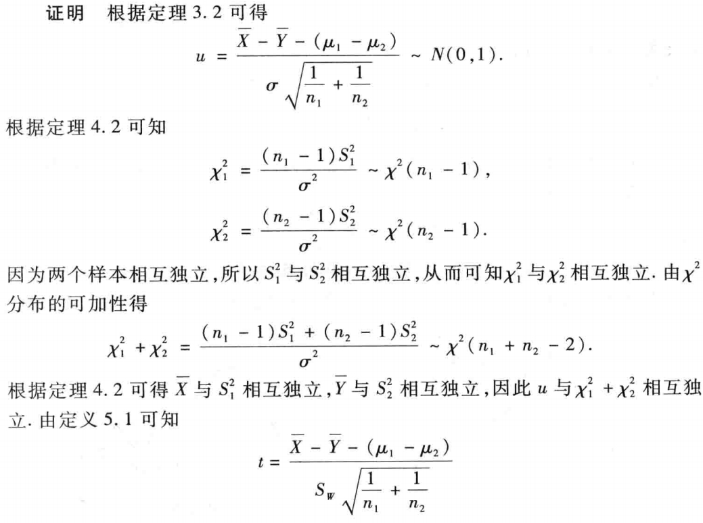
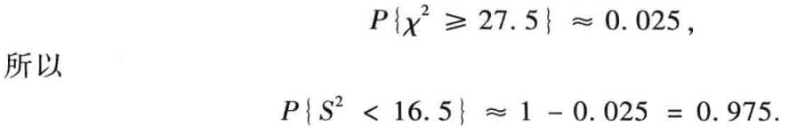
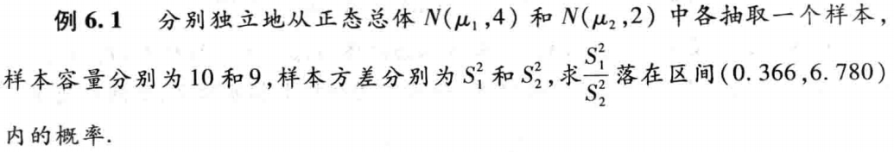

# 样本及样本函数的分布
## 0 总结

!!! note
    \begin{gather*}
        u = \dfrac{(\bar X - \mu)}{\sigma / \sqrt{n}} \sim N(0, 1) \\
        u = \dfrac{(\bar X - \bar Y - (\mu_1 - \mu_2))}{\sqrt{\frac{\sigma_1^2}{n_1} + \frac{\sigma_2^2}{n_2}}} \sim N(0, 1) \\
        \dfrac{(n - 1)S^2}{\sigma^2} = \dfrac{1}{\sigma^2}\sum_{i = 1}^{n}(X_i - \bar X)^2 \sim \chi^2(n - 1) \\
        \chi^2 = \dfrac{1}{\sigma^2}\sum_{i = 1}^n (X_i - \mu)^2 \sim \chi^2(n) \\
        T = \dfrac{\bar X - \mu}{S / \sqrt{n}} \sim t(n - 1) \\
        S_W = \sqrt{\dfrac{(n_1 - 1)S_1^2 + (n_2 - 1)S_2^2}{n_1 + n_2 - 2}}, T = \dfrac{\bar X - \bar Y - (\mu_1 - \mu_2)}{S_W\sqrt{\frac{1}{n_1} + \frac{1}{n_2}}} \sim t(n_1 + n_2 - 2) \\
        F = \dfrac{S_1^2/\sigma_1^2}{S_2^2/\sigma_2^2} = \dfrac{S_1^2}{S_2^2} \cdot \dfrac{\sigma_2^2}{\sigma_1^2} \sim F(n_1 - 1, n_2 - 1)\\
        F = \dfrac{\sum_{i = 1}^{n_1}(X_i - \mu_1)^2 / (n_1 \sigma_1^2)}{\sum_{j = 1}^{n_2}(Y_j - \mu_2)^2 / (n_2\sigma_2^2)} \sim F(n_1, n_2)
    \end{gather*}
          

## 1 总体与样本
    
- 总体：
    - 所研究对象的全体称为总体。
    - 总体中的每个具体对象称为个体。  
    - 总体中所包含的个体总数叫做总体容量。
- 简单随机样本：
    - 从总体中抽取若干个体进行观察试验，以获得有关总体的信息，这一抽取过程称为抽样，所抽取的部分个体称为样本。   
    - 样本中所包含的个体数目称为样本容量。
    - 简单随机抽样的样本的特点：随机性，代表性，独立性。
    - 每次抽样得到的具体数值称为样本值。
- 总体、样本、样本值的关系
    - 总体分布决定了样本取值的概率规律，也就是样本取到样本值的规律，因而可以由样本值去推断总体
    - 样本的联合分布函数

      \begin{equation}
        F(x_1, x_2, \cdots, x_n) = \prod_{i = 1}^{n} F_X(x_i) 
      \end{equation}

    - 样本的联合概率密度

      \begin{equation}
        f(x_1, x_2, \cdots, x_n) = \prod_{i = 1}^{n} f_X(x_i) 
      \end{equation}

    - 样本的联合分布律

    \begin{equation}
        P \left\{ X_1 = x_1, X_2 = x_2, \cdots, X_n = x_n \right\} = \prod_{i=1}^{n} p_X(x_i)
    \end{equation}

## 2 直方图与样本分布函数
- 直方图
    - 组距：横坐标每格代表的间距。
    - 分点应比样本观测值多取一位有效数字。
    - 作用：样本容量足够大时，落在小区间的频率近似为其概率，所以直方图可以大致反映随机变量的概率分布。
- 样本分布函数
    - 样本分布函数记为
        
        \begin{equation}
          F_n(x) = 
          \begin{cases}
          0 & x < x_{(1)}\\
          \sum_{j = 1}^i f_i & x_{(1)} \le x \le x_{(k)}\\
          1 & x \ge x_{(k)}
          \end{cases}
        \end{equation}
    
    - 由伯努利大数定律可知，$F_n(x)$ 按概率收敛于 $F(x)$。 

## 3 样本函数及其概率分布
- 统计量
    - 统计量是样本函数，是一个随机变量。
    - 统计量对应的样本函数 $g(X_1, X_2, \cdots, X_n)$ 中不含任何未知参数。
- 常用的统计量
    - 样本均值 $\bar X = \dfrac{1}{n}\sum_{i = 1}^n X_i$
    - 样本方差 $S^2 = \dfrac{1}{n - 1}\sum_{i = 1}^n(X_i - \bar X)^2 = \dfrac{1}{n - 1}(\sum_{i = 1}^n X_i^2 - x {\bar{X}}^2)$
    - 样本标准差 $S = \sqrt{S^2}$
    - 样本 $k$ 阶原点矩 $A_k = \dfrac{1}{n}\sum_{i = 1}^n X_i^k$
    - 样本 $k$ 阶中心矩 $B_k = \dfrac{1}{n}\sum_{i = 1}^n (X_i - \bar X)^k$
    - 样本最小值 $X_{(1)} = \max \left\{X_1, X_2, \cdots, X_n\right\}$
    - 样本最大值 $X_{(n)} = \max \left\{X_1, X_2, \cdots, X_n\right\}$

    !!! note "常用结论"
        若总体 $X$ 的 $E(X) = \mu, D(X) = \sigma^2$，则
            
        - $E(\bar X) = \mu, D(\bar X) = \dfrac{\sigma^2}{n}$
        - $E(S^2) = \sigma^2, D(S^2) = \dfrac{2\sigma^4}{n - 1}$
        - $E(B_2) = \dfrac{n - 1}{n}\sigma^2, D(B_2) = \dfrac{2(n - 1)\sigma^4}{n^2}$
        
        若总体 $X$ 的分布函数为 $F(x)$，则
            
        - $F_{\max}(x) = [F(x)]^n$
        - $F_{\min}(x) = 1 - [1 - F(x)]^n$

    !!! tip "有关 $E(S^2)$ 的一点细节"

        $$
          \begin{align*}
            E(S^2) & = E \left [\dfrac{1}{n - 1}\sum_{i = 1}^n (X_i - \bar X)^2 \right ] \\
                  & = E \left [\dfrac{1}{n - 1} \left (\sum_{i = 1}^n X_i^2 - n\bar X^2 \right ) \right ] \\
                  & = \dfrac{1}{n - 1} \left [\sum_{i = 1}^n E(X_i^2) - nE(\bar X^2) \right ] \\
                  & = \dfrac{1}{n - 1} \left \{ \sum_{i = 1}^n \left \{ D(X_i) + [E(X_i)]^2 \right \} - n \left \{ D(\bar X) + [E(\bar X)]^2 \right \} \right \} \\
                  & = \sigma^2
          \end{align*}
        $$

        这里注意 $\bar{X}$ 不能当作常量，故算 $E(\bar{X}^2)$ 的时候不能直接当成 $\bar{X}^2$，要当作样本变量来处理。

- 正态总体的两个抽样分布定理
    - $X_1, X_2, \cdots, X_n$ 是来自正态总体 $N(\mu, \sigma^2)$ 的样本，$\bar x$ 是样本均值，则随机变量

    \begin{equation}
      u = \dfrac{(\bar X - \mu)}{\sigma / \sqrt{n}} \sim N(0, 1)
    \end{equation}

    - 设 $X \sim N(\mu_1, \sigma_1^2), Y \sim N(\mu_2, \sigma_2^2)$ 分别独立地从总体 $X$ 和总体 $Y$ 中抽取样本 $X_1, X_2, \cdots, X_n$ 及 $Y_1, Y_2, \cdots, Y_n$，样本均值分别为 $\bar X$ 和 $\bar Y$。则随机变量

    \begin{equation}
      u = \dfrac{(\bar X - \bar Y - (\mu_1 - \mu_2))}{\sqrt{\frac{\sigma_1^2}{n_1} + \frac{\sigma_2^2}{n_2}}} \sim N(0, 1)
    \end{equation}

    !!! tip
        
        由 $\bar X - \bar Y \sim N \left ( \mu_1 - \mu_2, \dfrac{\sigma_1^2}{n_1} + \dfrac{\sigma_2^2}{n_2} \right )$ 推出。

## 4 $\chi^2$ 分布
- 设 $X_1, X_2, \cdots, X_n$ 相互独立分布，都服从 $N(0, 1)$，则称随机变量 $\chi^2 = X_1^2 + X_2^2 + \cdots + X_n^2$ 服从自由度为 $n$ 的 $\chi^2$ 分布，记为 $\chi^2 \sim \chi^2(n)$。这里自由度是独立的服从标准正态分布的随机变量的个数。

    

- $\chi^2$ 的性质
    - 若 $\chi^2 \sim \chi^2(n)$，则 $E(\chi^2) = n,D(\chi^2) = 2n$。
    - 若 $X \sim \chi^2(n_1), Y \sim \chi^2(n_2)$，且 $X, Y$ 相互独立，则 $X + Y \sim \chi^2(n_1 + n_2)$。
    - 当 $n$ 充分大时，$\chi^2$ 近似服从 $N(n, 2n)$，$\dfrac{\chi^2(n) - n}{\sqrt{2n}}$ 近似服从 $N(0, 1)$。
    - 设 $\chi^2 \sim \chi^2(n)$，对给定正数 $\alpha(0 < \alpha < 1)$，把满足条件 
      
        \begin{equation}
          P \left\{ \chi^2 > \chi_{\alpha}^2(n)\right\} = \int_{\chi_{\alpha}^2(n)}^{+\infty}f(x)dx = \alpha
        \end{equation}

        的点 $\chi_{\alpha}^2(n)$ 称为 $\chi^2(n)$ 分布的上 $\alpha$ 分位点。

        并且当 $n$ 充分大时， $\chi_{\alpha}^2 \approx n + \sqrt{2n}u_{\alpha}$，其中 $u_{\alpha}$ 是标准正态分布的上 $\alpha$ 分位数。

      

- 相关定理
    - 设 $X_1, X_2, \cdots, X_n$ 是来自总体 $N(\mu, \sigma^2)$ 的样本，则随机变量

        \begin{equation}
          \chi^2 = \dfrac{1}{\sigma^2}\sum_{i = 1}^n (X_i - \mu)^2 \sim \chi^2(n)
        \end{equation} 

    - 设总体 $X$ 服从正态分布 $N(\mu, \sigma^2)$，从总体 $X$ 中抽取样本 $X_1, X_2, \cdots, X_n$，样本均值和样本方差分别为 $\bar X$ 和 $S^2$，则有
        - $\bar X$ 和 $S^2$ 相互独立。
        - $\dfrac{(n - 1)S^2}{\sigma^2} = \dfrac{1}{\sigma^2}\sum_{i = 1}^{n}(X_i - \bar X)^2 \sim \chi^2(n - 1)$ 

    ??? success "证明 $\dfrac{(n - 1)S^2}{\sigma^2} \sim \chi^2(n - 1)$"

        \begin{align*}
          \dfrac{\sum (x_i - \bar x)^2}{\sigma^2} & = \dfrac{\sum [(x_i - \mu) + (\mu - \bar x)]^2}{\sigma^2} \\
                                                & = \dfrac{\sum (x_i - \mu)^2}{\sigma^2} - \dfrac{(\mu - \bar x)^2}{\sigma^2 / n} \\
                                                & = \chi^2(n) - \chi^2(1) \\
                                                & = \chi^2(n - 1)
        \end{align*}

      

## 5 t 分布
- 设 $X \sim N(0, 1), Y \sim \chi^2(n)$，且 $X$ 与 $Y$ 独立，则称随机变量 $T = \dfrac{X}{\sqrt{Y/n}}$ 服从自由度为 $n$ 的 t 分布，记作 $T \sim t(n)$。这里的自由度源于 $\chi^2(n)$ 的自由度。特殊的，$n = 1$ 时为柯西分布。

    

- 设 $t \sim t(n)$，对给定正数 $\alpha(0 < \alpha < 1)$，把满足条件 
      
    \begin{equation}
      P \left\{ t(n) > t_{\alpha}(n)\right\} = \int_{t_{\alpha}(n)}^{+\infty}f(x)dx = \alpha
    \end{equation}

    的点 $t_{\alpha}(n)$ 称为 $t(n)$ 分布的上 $\alpha$ 分位点。

    特殊地，有 $-t_{\alpha}(n) = t_{1 - \alpha}(n)$。

    

- 相关定理
    - 设 $X_1, X_2, \cdots, X_n$ 是来自总体 $N(\mu, \sigma^2)$ 的样本，样本均值为 $\bar X$，样本方差为 $S^2$，则随机变量

        \begin{equation}
          T = \dfrac{\bar X - \mu}{S / \sqrt{n}} \sim t(n - 1)
        \end{equation} 
    
        ??? success "Proof"

            

    - 设从两个正态总体 $N_1(\mu_1, \sigma^2), N_2(\mu_2, \sigma^2)$ 中分别独立地抽取样本，样本容量依次为 $n_1$ 和 $n_2$，样本均值依次为 $\bar X$ 和 $\bar Y$，样本方差依次为 $S_1^2$ 和 $S_2^2$。记

        \begin{equation}
          S_W = \sqrt{\dfrac{(n_1 - 1)S_1^2 + (n_2 - 1)S_2^2}{n_1 + n_2 - 2}}
        \end{equation} 

        则随机变量

        \begin{equation}
          T = \dfrac{\bar X - \bar Y - (\mu_1 - \mu_2)}{S_W\sqrt{\frac{1}{n_1} + \frac{1}{n_2}}} \sim t(n_1 + n_2 - 2)
        \end{equation} 

        ??? success "Proof"

             

             

## 6 F 分布
- 设 $X \sim \chi^2(n_1), Y \sim \chi^2(n_2)$，且 $X$ 和 $Y$ 相互独立，则称随机变量 $F = \dfrac{  X / n_1}{Y / n_2}$ 服从第一自由度为 $n_1$， 第二自由度为 $n_2$ 的 F 分布，记作 $F \sim F(n_1, n_2)$。

- 设 $F \sim F(n_1, n_2)$，对给定正数 $\alpha(0 < \alpha < 1)$，把满足条件 
      
    \begin{equation}
      P \left\{ F > F_{\alpha}(n_1, n_2)\right\} = \int_{F_{\alpha}(n_1, n_2)}^{+\infty}f(x)dx = \alpha
    \end{equation}

    的点 $F_{\alpha}(n_1, n_2)$ 称为 $F(n_1, n_2)$ 分布的上 $\alpha$ 分位点。

    

    且满足性质 $F_{1 - \alpha}(n_1, n_2) = \dfrac{1}{F_{\alpha}(n_2, n_1)}$。

    ??? success "Proof"

        

- 相关定理
    - 设 $X_1, X_2, \cdots, X_{n_1}$ 是来自总体 $N(\mu_1, \sigma_1^2)$ 的样本，$Y_1, Y_2, \cdots, Y_{n_2}$ 是来自总体 $N(\mu_2, \sigma_2^2)$ 的样本，且这两个样本相互独立，则随机变量

        \begin{equation}
            F = \dfrac{\sum_{i = 1}^{n_1}(X_i - \mu_1)^2 / (n_1 \sigma_1^2)}{\sum_{j = 1}^{n_2}(Y_j - \mu_2)^2 / (n_2\sigma_2^2)} \sim F(n_1, n_2)
        \end{equation}  

    - 设从两个正态总体 $N(\mu_1, \sigma_1^2), N(\mu_2, \sigma_2^2)$ 中分别独立地各抽取一个样本，它们的样本容量分别为 $n_1$ 和 $n_2$，样本均值依次为 $\bar X$ 和 $\bar Y$，样本方差依次为 $S_1^2$ 和 $S_2^2$。则随机变量

        \begin{equation}
            F = \dfrac{S_1^2/\sigma_1^2}{S_2^2/\sigma_2^2} = \dfrac{S_1^2}{S_2^2} \cdot \dfrac{\sigma_2^2}{\sigma_1^2} \sim F(n_1 - 1, n_2 - 1)
        \end{equation}  

    > 利用这条定理可以找到 $\dfrac{S_1^2}{S_2^2}$ 所服从的概率分布。

    !!! tip

        $\dfrac{S}{\sigma}$ 是一个很重要的分式，它可以经过分子分母同时乘以 $(n - 1)$，结合公式 $\dfrac{(n - 1)S^2}{\sigma^2} \sim \chi^2(n - 1)$ 变成 F 分布 / t 分布的组成部分。 

## 7 例题
  
- e.g.1
  
    

    ??? success "Solution"

        

- e.g.2

    

    ??? success "Solution"

        

- e.g.3

    

    ??? success "Solution"

        

        

- e.g.4

    

    ??? success "Solution"

        

        

- e.g.5

    

    ??? success "Solution"

        

        

- e.g.6

    

    ??? success "Solution"

        