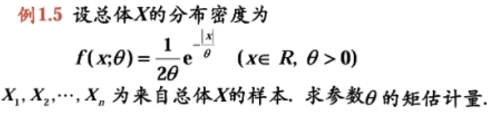
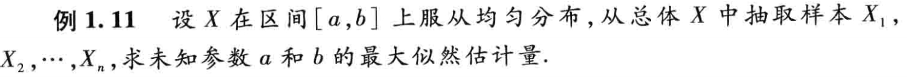
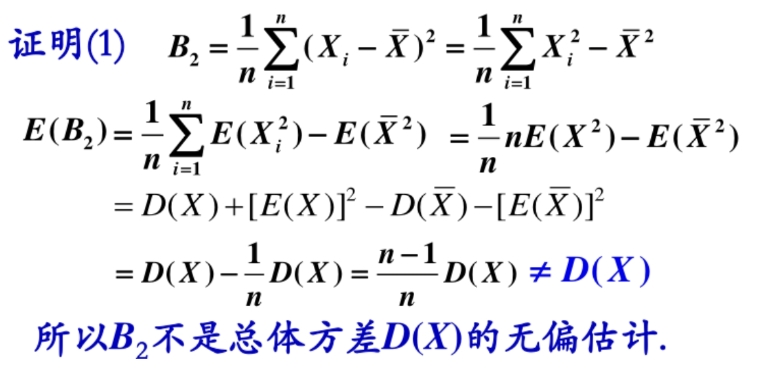
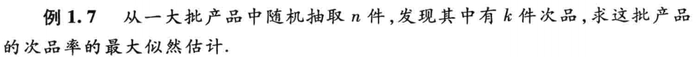
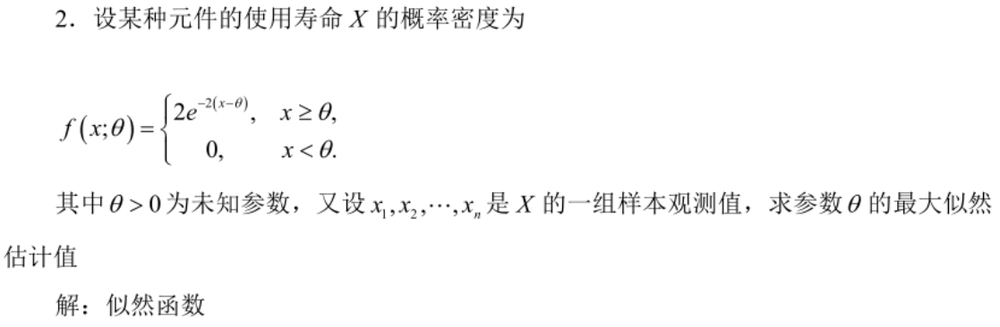

# 参数估计
## 0 总结

## 1 参数的点估计
### 1.1 矩估计法
- 设 $\mu_k$ 为总体的 $k$ 阶矩，$A_k$ 为样本的 $k$ 阶矩。由辛钦大数定理可知当 $n$ 足够大时，二者趋近相等，故可联立等式。若关于 $X$ 的分布中有 $r$ 个未知数，则分别设出 $\mu_1, \cdots, \mu_k$ 和 $A_1, \cdots, A_k$，联立 $r$ 个等式即可。

    !!! note
        - 在总体的均值和方差都存在时，求均值 $\mu$ 和方差 $\sigma^2$ 的矩估计量，并不一定要知道总体服从什么分布。无论总体服从什么分布，都有
              - 总体均值的矩估计量 $\hat \mu = \bar X$。
              - 总体方差的矩估计量 ${\hat \sigma}^2 = A_2 - {\bar X}^2 = B_2$。
        - 总体未知量的矩估计量不是唯一的。

    !!! tip

        矩估计法的核心就是利用样本的 $1, 2, ..., r$ 阶矩和总体的 $1, 2, ..., r$ 阶矩近似相等。

### 1.2 最大似然估计法
- 离散分布情况
    
    设分布律中的未知参数为 $\theta_1, \cdots, \theta_r$（即 $P\left\{X = x\right\} = p(x, \theta_1, \cdots, \theta_r)$），对于 $n$ 个事件 $X_1, \cdots, X_n$，样本对应的结果分别是 $x_1, \cdots, x_n$。设 $L(\theta_1, \cdots, \theta_r) = \prod_{i = 1}^n f(X_i = x_i, \theta_1, \cdots, \theta_r)$，则 $L(\theta_1, \cdots, \theta_r)$ 称为似然函数。其中使得 $L$ 函数取得最大值的 $\theta_i$ 作为未知参数的估计值，记作 $\hat{\theta_i}$，称为最大似然估计值。

- 连续分布情况

    与离散情况完全同理，只是将分布律改为概率密度。

    !!! note
        - **一言以蔽之，最大似然估计就是改变 $\theta$ 的值使得 $L$ 取值最大，使得样本结果最有可能出现。**
        - 对于 $\theta_i$ 的求法，就是联立 $\dfrac{\partial L}{\partial \theta_i} = 0$ 或 $\dfrac{\partial \ln L}{\partial \theta_i} = 0$（后者使用次数更多）方程，然后求解。
        - **值得注意的是，这里算概率的时候不用考虑样本打乱顺序排列的全部概率，即每个样本出现都是有序的，第一个样本就是 $x_1$，第二个就是 $x_2$，以此类推。**
        - 参数的最大似然估计不是唯一的，也可能不存在。
        - 若 $\hat \theta$ 是未知参数 $\theta$ 的最大似然估计，且满足 $g(\theta)$ 是关于 $\theta$ 的严格单调函数，则 $g(\theta)$ 的最大似然估计还是在 $\theta = \hat \theta$ 时取到，即 $g(\hat{\theta})$。
            
            ??? example "有点抽象，举个栗子（？"
                - 比如要求 $p$ 的最大似然估计，已经知道了 $\hat{\lambda} = \bar X$，然后通过代入特值可以知道 $p = e^{-\lambda}$，那么就不用再用求偏导求 $p$ 的最大似然估计了，直接将 $\hat{\lambda}$ 代入 $p$ 的表达式即可，便是 $\hat{p}$ 的值。

    !!! tip "估计值和估计量的区别"
        - 对于估计值，$\theta = \hat{\theta}(x_1, \cdots, x_r)$
        - 对于估计量，$\theta = \hat{\theta}(X_1, \cdots, X_r)$ 

## 2 估计量的评选标准
### 2.1 无偏性
- 设 $\hat{\theta} = \hat{\theta}(X_1, X_2, \dots, X_n)$ 是未知参数 $\theta$ 的估计量，若 $E(\hat{\theta})$ 存在且 $E(\hat{\theta}) = \theta$，那么 $\hat{\theta}$ 为 $\theta$ 的无偏估计量，否则称为有偏估计量。
 
    !!! note
        - 设总体 $X$ 的均值和方差都存在，$X_1, X_2, \dots, X_n$ 是来自总体 $X$ 的样本，证明无论总体 $X$ 服从什么分布，均有
        - 样本均值 $\bar X$ 是总体均值 $E(X)$ 的无偏估计量。
        - 样本方差 $S^2$ 是总体方差 $D(X)$ 的无偏估计量。
        - 样本 $k$ 阶矩 $A_k$ 是总体 $k$ 阶矩 $E(X^k)$ 的无偏估计量。

### 2.2 有效性
- 设 $\hat{\theta_1} = \hat{\theta_1}(X_1, X_2, \dots, X_n)$ 和 $\hat{\theta_2} = \hat{\theta_2}(X_1, X_2, \dots, X_n)$ 都是总体参数 $\theta$ 的无偏估计量，若 $D(\hat{\theta_1}) < D(\hat{\theta_2})$，则称 $\hat{\theta_1}$ 比 $\hat{\theta_2}$ 更有效。

### 2.3 一致性
- 设 $\hat{\theta_n} = \hat{\theta_n}(X_1, X_2, \dots, X_n)$ 是未知参数 $\theta$ 的估计量序列，当 $n \to \infty$ 时，$\hat{\theta_n}$ 依概率收敛于 $\theta$，即 $\forall \theta > 1$，有

    \begin{equation}
      \lim_{n \to \infty} P\left\{|\theta_n - \theta| < \varepsilon\right\} = 1
    \end{equation}

    则称 $\hat{\theta_n}$ 是未知参数 $\theta$ 的一致估计量。

    !!! note
        - 样本 $k$ 阶矩是总体 $k$ 阶矩的一致性估计量。
        - 矩估计法得到的估计量一般为一致估计量。在一定条件下，最大似然估计量具有一致性。

    !!! note
        - 无偏性的统计含义：在大量重复实验下，有所得 $\hat{\theta}$ 的估计值的平均值恰是真值 $\theta$，从而保证没有系统误差。
        - 一致性是针对样本容量 $n \to \infty$ 而言的，对于固定样本容量的样本，一致性无意义；而无偏性和有效性则是对于固定样本容量的样本而言的。

## 3 参数的区间估计
- 设总体 $X$ 的分布中含有一个未知参数 $\theta$，$X_1,X_2,…,X_n$ 是来自总体的样本，如果对于给定值 $1-\alpha(0<\alpha<1)$，存在两个统计量

    \begin{equation}
      \theta_1 = \theta_1(X_1, X_2, ..., X_n), \theta_2 = \theta_2(X_1, X_2, ..., X_n) (\theta_1 < \theta_2)
    \end{equation}

    使得 $P\{\theta_1 < \theta < \theta_2\} = 1 - \alpha$，

    则称 $1-\alpha$ 为置信度（置信水平），称随机区间为参数 $\theta$ 的置信水平为的置信区间，$\theta_1, \theta_2$ 分别称为置信下限和置信上限。

    这种通过构造一个置信区间对未知参数进行估计的方法称为区间估计.

    !!! note
        - 置信度表示了在置信区间 $(\theta_1, \theta_2)$ 中，包含参数 $\theta$ 真值的可能性为 $(1 - \alpha)$。
        - $1 - \alpha$ 越大，可靠性越高。
        - 置信区间长度 $\theta_2 - \theta_1$ 表示估计精度，置信区间越小，估计越精确，但置信水平会降低。较长的置信区间精度降低，但是更可靠。对于固定的样本容量，置信区间和精度成反比。
        - 优先确保可靠性再提高精度。
        - 当 $\alpha$ 确定后，常选择最小的那个置信区间。

## 4 正态总体参数的区间估计
### 4.1 单个正态总体的区间估计
- $\sigma^2$ 已知，$\mu$ 的置信水平为 $1 - \alpha$ 的置信区间。

    利用 $u = \dfrac{\bar X - \mu}{\sigma / \sqrt{n}} \sim N(0, 1)$，然后从 $u$ 的置信区间可以推出 $\mu$ 的置信区间为 $(\bar X - u_{\alpha / 2}\dfrac{\sigma}{\sqrt{n}}, \bar X + u_{\alpha / 2}\dfrac{\sigma}{\sqrt{n}})$。

- $\sigma^2$ 未知，$\mu$ 的置信水平为 $1 - \alpha$ 的置信区间。

    利用 $t = \dfrac{\bar X - \mu}{\sigma / \sqrt{n}} \sim t(n - 1)$，然后从 $t$ 的置信区间可以推出 $\mu$ 的置信区间为 $\left(\bar X - t_{\alpha / 2}(n - 1)\dfrac{S}{\sqrt{n}}, \bar X + t_{\alpha / 2}(n - 1)\dfrac{S}{\sqrt{n}}\right)$。

- $\mu$ 已知，$\sigma^2$ 的置信水平为 $1 - \alpha$ 的置信区间。

    利用 $\chi^2 = \sum_{i = 1}^n(\dfrac{X_i - \mu}{\sigma})^2 \sim \chi^2(n)$，然后从 $\chi^2$ 的置信区间可以推出 $\sigma^2$ 的置信区间为 $(\dfrac{\sum_{i = 1}^n(X_i - \mu)^2}{\chi_{\frac{\alpha}{2}}^2(n)}, \dfrac{\sum_{i = 1}^n(X_i - \mu)^2}{\chi_{\frac{1 - \alpha}{2}}^2(n)})$。

- $\mu$ 未知，$\sigma^2$ 的置信水平为 $1 - \alpha$ 的置信区间。

    利用 $\chi^2 = \dfrac{(n - 1)S^2}{\sigma^2} \sim \chi^2(n - 1)$，然后从 $\chi^2$ 的置信区间可以推出 $\sigma^2$ 的置信区间为 $(\dfrac{(n - 1)S^2}{\chi_{\frac{\alpha}{2}}^2(n - 1)}, \dfrac{(n - 1)S^2}{\chi_{\frac{1 - \alpha}{2}}^2(n - 1)})$。

    !!! tip
        - $l$ 和 $\alpha, n$ 均有关系，可以通过改变这两个值来改变区间长度。  

### 4.2 两个正态总体的区间估计
- $\sigma_1^2, \sigma_2^2$ 已知，$\mu_1 - \mu_2$ 的置信水平为 $1 - \alpha$ 的置信区间。

    利用 $u = \dfrac{(\bar X - \bar Y) - (\mu_1 - \mu_2)}{\sqrt{\frac{\sigma_1^2}{n_1} + \frac{\sigma_2^2}{n_2}}} \sim N(0, 1)$，然后从 $u$ 的置信区间可以推出 $\mu_1 - \mu_2$ 的置信区间为 $((\bar X - \bar Y) - u_{\alpha / 2}\sqrt{\frac{\sigma_1^2}{n_1} + \frac{\sigma_2^2}{n_2}}, (\bar X - \bar Y) + u_{\alpha / 2}\sqrt{\frac{\sigma_1^2}{n_1} + \frac{\sigma_2^2}{n_2}})$。

- $\sigma_1^2 = \sigma_2^2 = \sigma^2$ 但未知，$\mu_1 - \mu_2$ 的置信水平为 $1 - \alpha$ 的置信区间。

    利用 $t = \dfrac{(\bar X - \bar Y) - (\mu_1 - \mu_2)}{S_w\sqrt{\frac{1}{n_1} + \frac{1}{n_2}}} \sim t(n_1 + n_2 - 2)$，然后从 $t$ 的置信区间可以推出 $\mu_1 - \mu_2$ 的置信区间为 $\left((\bar X - \bar Y) - t_{\alpha / 2}(n_1 + n_2 - 2)S_w\sqrt{\frac{1}{n_1} + \frac{1}{n_2}, (\bar X - \bar Y) + t_{\alpha / 2}(n_1 + n_2 - 2)S_w\sqrt{\frac{1}{n_1} + \frac{1}{n_2}\right)$。

    其中 $S_w = \sqrt{\dfrac{(n_1 - 1)S_1^2 + (n_2 - 1)S_2^2}{n_1 + n_2 - 2}}$。

- $\mu_1, \mu_2$ 已知，方差比 $\dfrac{\sigma_1^2}{\sigma_2^2}$ 的置信水平为 $1 - \alpha$ 的置信区间。

    利用 $F = \dfrac{n_2\sigma_2^2\sum_{i = 1}^{n_1} (X_i - \mu_1)^2}{n_1\sigma_1^2\sum_{j = 1}^{n_2} (Y_j - \mu_2)^2} \sim F(n_1, n_2)$，然后从 $F$ 的置信区间可以推出 $\dfrac{\sigma_1^2}{\sigma_2^2}$ 的置信区间为 $\left(\dfrac{n_2\sum_{i = 1}^{n_1} (X_i - \mu_1)^2}{n_1\sum_{j = 1}^{n_2} (Y_j - \mu_2)^2 F_{\frac{\alpha}{2}}(n_1, n_2)}, \dfrac{n_2\sum_{i = 1}^{n_1} (X_i - \mu_1)^2 F_{\frac{\alpha}{2}}(n_2, n_1)}{n_1\sum_{j = 1}^{n_2} (Y_j - \mu_2)^2}\right)$ 

- $\mu_1, \mu_2$ 未知，方差比 $\dfrac{\sigma_1^2}{\sigma_2^2}$ 的置信水平为 $1 - \alpha$ 的置信区间。

    利用 $F = \dfrac{S_1^2 / S_2^2}{\sigma_1^2 / \sigma_2^2} \sim F(n_1 - 1, n_2 - 1)$，然后从 $F$ 的置信区间可以推出 $\sigma^2$ 的置信区间为 $\left(\dfrac{S_1^2}{S_2^2 F_{\frac{\alpha}{2}(n_1 - 1, n_2 - 1)}}, \dfrac{S_1^2}{S_2^2} F_{\frac{\alpha}{2}(n_2 - 1, n_1 - 1)}\right)$。

    !!! note

        **双变量和单变量处理方法很类似，主要是要记住 6 个概率分布公式（双变量和单变量有两个是重复的）。**

## 5 单侧置信区间
- 若有 $P \left\{\theta > \theta_1 \right\} = 1 - \alpha$（或 $P \left\{ \theta < \theta_2 \right\} = 1 - \alpha$），则称 $(\theta_1, +\infty)$（或 $(-\infty, \theta_2)$）为置信水平为 $1 - \alpha$ 的单侧置信区间。

    $\theta_1$ 为置信水平为 $1 - \alpha$ 的单侧置信下限。
    
    $\theta_2$ 为置信水平为 $1 - \alpha$ 的单侧置信上限。
    
- $\sigma^2$ 已知，$\mu$ 的置信水平为 $1 - \alpha$ 的单侧置信区间。

    利用 $u = \dfrac{\bar X - \mu}{\sigma / \sqrt{n}} \sim N(0, 1)$，
    
    对于 $P\left\{ \dfrac{\bar X - \mu}{\sigma / \sqrt{n}} < u_{\alpha}\right\} = 1 - \alpha$ 可以得出单侧置信区间为 $(\bar X - u_{\alpha}\dfrac{\sigma}{\sqrt{n}}, +\infty)$，其下限为 $\bar X - u_{\alpha}\dfrac{\sigma}{\sqrt{n}}$。

    对于 $P\left\{ \dfrac{\bar X - \mu}{\sigma / \sqrt{n}} > u_{\alpha}\right\} = 1 - \alpha$ 可以得出单侧置信区间为 $(-\infty, \bar X + u_{\alpha}\dfrac{\sigma}{\sqrt{n}})$，其上限为 $\bar X + u_{\alpha}\dfrac{\sigma}{\sqrt{n}}$。

- $\sigma^2$ 未知，$\mu$ 的置信水平为 $1 - \alpha$ 的单侧置信区间。

    利用 $t = \dfrac{\bar X - \mu}{S / \sqrt{n}} \sim t(n - 1)$，
    
    对于 $P\left\{ \dfrac{\bar X - \mu}{\sigma / \sqrt{n}} < t_{\alpha}(n - 1)\right\} = 1 - \alpha$ 可以得出单侧置信区间为 $(\bar X - t_{\alpha}(n - 1)\dfrac{S}{\sqrt{n}}, +\infty)$，其下限为 $\bar X - t_{\alpha}(n - 1)\dfrac{S}{\sqrt{n}}$。

    对于 $P\left\{ \dfrac{\bar X - \mu}{\sigma / \sqrt{n}} > t_{\alpha}(n - 1)\right\} = 1 - \alpha$ 可以得出单侧置信区间为 $(-\infty, \bar X + t_{\alpha}(n - 1)\dfrac{S}{\sqrt{n}})$，其上限为 $\bar X + t_{\alpha}(n - 1)\dfrac{S}{\sqrt{n}}$。

- $\mu$ 未知，$\sigma^2$ 的置信水平为 $1 - \alpha$ 的单侧置信区间上限。

    利用 $\chi^2 = \dfrac{(n - 1)S^2}{\sigma^2} \sim \chi^2(n - 1)$，

    对于 $P\left\{ \dfrac{(n - 1)S^2}{\sigma^2} > \chi^2_{1 - \alpha}(n - 1)\right\} = 1 - \alpha$ 可以得出单侧置信区间为 $(0, \dfrac{(n - 1)S^2}{\chi^2_{1 - \alpha}(n - 1)})$，其上限为 $\dfrac{(n - 1)S^2}{\chi^2_{1 - \alpha}(n - 1)}$。

## 6 例题

- e.g.1

    

    ??? success "Solution"
    
        
        
        

- e.g.2

    
    
    ??? success "Solution"
    
        
        

        !!! note

            本题不能直接求偏导求出答案，观察得 $a, b$ 均存在范围，结合单调性可以求出 $a, b$ 在何处取得极值。

- e.g.3

    

    ??? success "Solution"
    
        

- e.g.4

    

    ??? success "Solution"
    
        
        
        

- e.g.5 **有细节需要注意**

    

    ??? success "Solution"
    
        
        
        

        !!! note
            **在本题中书上的做法是相当于看作是 $n$ 次样本取样，由于 $L(\theta) = \prod p(x_i)$，所以前面不用乘以 $C_{n}^k$，但是如果当作是一次样本取样，样本服从二项分布，那么算概率的时候就要乘以 $C_{n}^{k}$，不过由于在求导的时候 $C_{n}^{k}$ 不含有 $p$，所以对求导结果不产生影响。但是我们一般在选取样本的时候，都会选择多个样本来估计参数，而不是只选一个样本来估计，所以最好按照书上的当作是 $n$ 次服从 $(0 - 1)$ 分布的样本来做。**

- e.g.6 **多变量的最大似然估计**

    

    ??? success "Solution"
    
        

        !!! tip

            如果要求的是 $\sigma$ 的最大似然估计，就要对 $\sigma$ 求偏导。

- e.g.7 
    
    

    ??? success "Solution"
    
        
        
        

        !!! note

            这里求 $\hat{\theta}$ 的分布函数的时候用到的是算 $\max\{X_1, X_2, ..., X_n\}$ 的性质公式。  

- e.g.8

    

    ??? success "Solution"
    
        
        
        

- e.g.9

    

    ??? success "Solution"
    
        

- e.g.10

    

    ??? success "Solution"
    
        

        

- e.g.11

    

    ??? success "Solution"
    
        